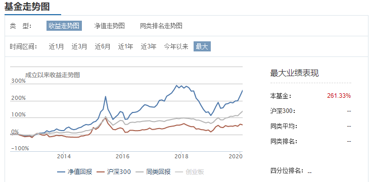

# 千万别听销售经理瞎忽悠

基金的业绩到底有没有参考性，应该说是有的，就好比一个孩子，他经常考试都是名列前茅，我们还是能说这是一个好孩子的，但是这只限于长期范畴，甚至要经过几个周期来判定，而某一次考试突然名列前茅，反而值得怀疑，就好比有些基金，一直业绩一般，突然某一年业绩大涨。为什么？基本上就是狗屎运而已，赶上了这波行情，刚好适应这只基金的策略和风格，或者赶上了某只重仓股连续被炒作，所以业绩大幅度提升。这种业绩不但不具备参考性，反而应该视为反向指标。也就是说一只基金在短期内业绩大涨，反而应该视为一种风格到头的信号。

	

比如国泰成长，在2018年初的业绩达到顶峰，还拿了金牛奖，但是翻看之前的历史，他是比较激进的一种风格，只有2016年以来明显跑赢市场，所以这就是赶上了一波行情，到了2018年，回撤可就大了，几乎掉了40%，但是这样一只曾经拿过金牛奖的基金，在大幅跑输市场之后，反而迎来了重要的投资机会。最近6个月又明显跑赢市场，回到了2018年的顶峰。所以基金跟孩子一样，从小一帆风顺，没经历过挫折，不是什么好事，短期内特别顺利，也不是什么好事。

其次，我们都知道，80-90%的主动基金长期下来的年化回报很难跑赢指数。华尔街有研究机构做了测试，选择一段时间跌的最多的基金，一段时间涨的最多的基金，和指数放在一起做对比测试，最后发现了一个现象，买热门基金的收益是最差的，而买指数和买最冷门基金的表现不确定，这就告诉我们，一定不能追热门，大热必死。至于要不要买冷门，让你买跌的最多的基金，你也很难接受。所以还是踏踏实实买指数吧。这个不是最好的，但也是相当好的选择。

第三，不得不承认，主动基金中确实有好的，也有高手，但是胜率确实太低了，你从热门基金里找出真有本事的基金，比你选择优秀个股的难度可能也差不多。那这些优秀的业绩是怎么产生的呢？世界杯的时候赌过球吗？说对冠军挺难的，但是你要每只球队都赌一遍，那就肯定有一个是正确的了，其实基金公司就是这么干的，所以他们总可以制造出明星基金，从而通过这些明星基金，来圈投资者的钱。这在公募基金行业已经非常普遍，公募基金吃的就是管理费，所以对他们来说规模很重要，当一个基金经理，取得好的业绩之后，他们就倾向于赶紧让他再多发一只产品，从而上规模，如果能募集50亿，那么对于基金公司来说，一年管理费就增加了几千万。而他的成本几乎是零，这个基金经理的团队都是现成的，甚至有的连重仓股都不换，就复制到新发的基金上去。

基金公司通常产品线会比较齐全，有投蓝筹的，有投成长的，有均衡策略，有价值策略，还有成长策略，再不济也会有至少10来个行业基金各自蹲守据点，所以市场某一时刻倾向于某种风格，就一定会有某个产品，符合这种风格，从而业绩大涨，比如2020年初，这些半导体基金大涨，那些投资半导体的基金经理，马上就站出来发新基金了。

因此：

* 千万别被理财经理洗脑，他们告诉你的热门基金，大多不靠谱，业绩太好反而是个坑，甚至可以当成反向指标。
* 也最好不要去买冷门，因为冷门总让人很难受，比如现在让你买传媒，买环保，买汽车，不知道这些行业是不是趋势性衰退，从长期看，买冷门和买宽基指数表现差不多，选股的难度远比择时大的多，所以尽量不要做选行业和选股的工作，胜算太低。
* 热门行业的基金更不要考虑，因为基金公司会把每个球队都预测一遍，总会有一个是对的，所以某一个行业基金涨的好，跟基金经理毛关系都没有，只是他的马快，这段时间顺风罢了。过一段风向变了，马换了，他就该倒霉了，比如半导体基金，现在都在吹最近半年翻倍的事，而2018年大跌一半的事，从来没人提。
* 不买新基金，因为新发基金，基本都是热门基金的经理挂帅，思路都是市场最热的思路，跟追热门没什么区别，有个别基金可能还行，但是这种方法，失败的概率极高。所以永远记住，不买新基金就对了。