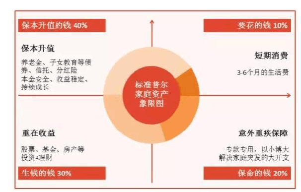
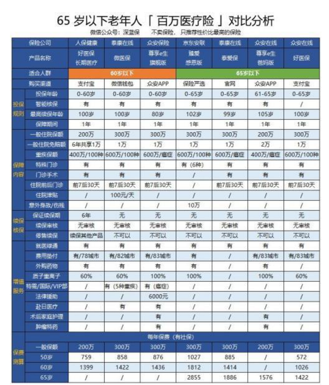
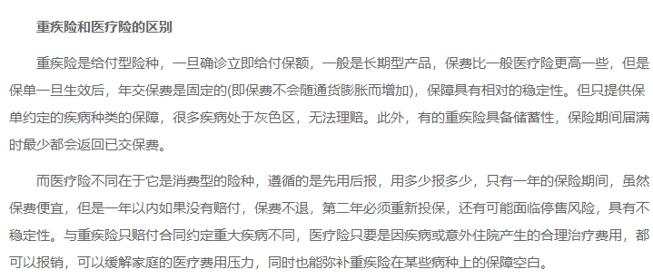
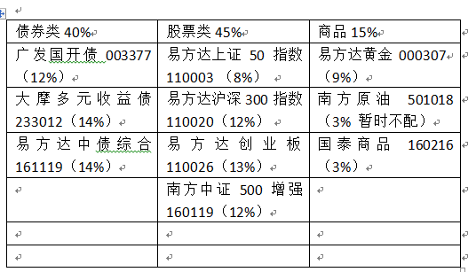

# 家庭资产如何配备

理财是理财，投资是投资，理财里面包含了流动性，消费，保障和投资四个部分，投资只是其中的一块。对于家庭的所有财产来说，全都拿去投资，其实并不合适。

	

在国际上，有一个简单的标准普尔家庭资产示意图，这也是一般理财师会做出的资产配置方式，会将家庭资产分为四个部分。这张图分为四个象限，右上象限，是要花的钱，右下象限是保命的钱，左上是保本的钱，左下是升值投资的钱。

第一是**要花的钱**，也就是右上象限，重点在于流动性，这部分给了两个标准，一个是总资产的10%，另一个是3-6个月的生活费，看哪个需要的钱多，你就用哪个标准。比如你家每月要花5000，你一共就50万存款，那么10%就是5万，而6个月生活费是3万，那么你就准备5万块钱放在这里。如果你就10万存款，10%只有1万，生活费却需要3万，那你就准备3万放在这里，这是一个必须要保障的位置。这部分理财可以放在货币基金里，或者买一些短债，要求流动性好，又绝对安全，必须要保本保收益。

	

第二是**保命的钱**，也就是右下象限，这块是保险的份额，大概占到20%，其实对于家庭来说，只需要买四类保险：

* 1、百万医疗险，解决的是大额医疗费全额报销的问题，大概一年也就是千把块，有这个东西就基本上不用再担心看不起病的问题了。
* 2、重疾险，主要是重大疾病的保障，也就是那些不报销的重大疾病，这种重疾险也不是特别贵一年也就几千块钱，就能保几百万。而且要选择保费豁免，最好是夫妻一起投，选择既有投保人豁免也有被保人豁免，夫妻相互投保。这样一旦有人得病，两份保单同时有效，后面的保费也就都不用再交了，能省不少钱。
* 3、定期寿险，只给家里的经济支柱买，老人和孩子不用买，因为买了也赔不了多少钱，主要是给家里其他人的生活费。
* 4、意外险，主要保意外事件，这个也并不贵，一家子下来，一年一万块钱左右就应该够用了。

	

第三是**保本的钱**，也就是左上象限，这部分钱重点在于保本保收益，对于流动性没那么大的要求了，他的标准是40%，也就是说你要将自己财产的一小部分都放在这里，这其实跟资产配置里的债券基金部分基本吻合。可以投资一些长债基金，在利率急速上升的时候，这部分钱与货币基金相互替换。

第四是**投资的钱**，也就是左下象限，这部分应该投资一些相对的高风险资产，比如股票，商品期货，股权基金等等，大概占你总资产的30%左右，这部分跟你的右上象限合并计算，也就是说如果10%的钱不够你覆盖6个月生活费的情况下，优先从投资的部分里面扣减。扣减了要花的钱之后，也就确定了投资的这部分钱，可以跟左上角的内容合并，左半侧就是常说的用来投资的钱。无论做半自动组合，还是做我们的股债商品全天候配置组合，都是可以的。比例也基本上差不太多。

	

