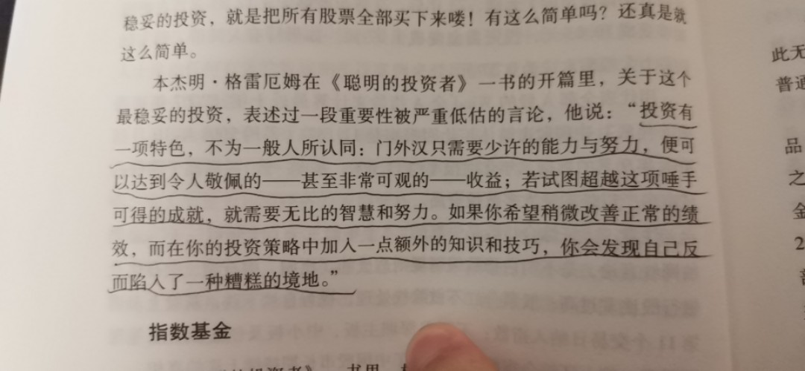
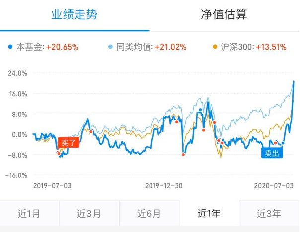
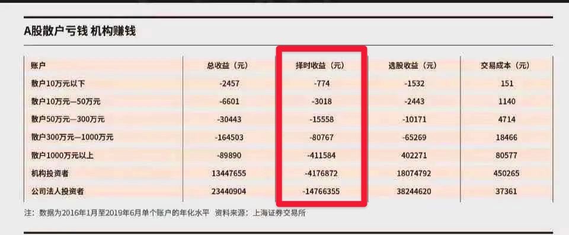
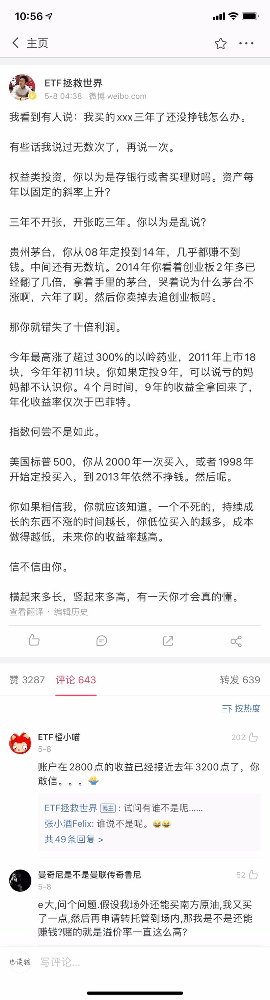

# 理财投资务必牢记初心

<!-- toc -->

## 理财投资进阶其实并非必须

	

现在的水平就是个入门级选手，不会技术分析也不会财务报告，当然也不会瞎搞，盯着一个目标就一直拿着不放手，反正自己的目的就是强制储蓄，早点实现财务自由。也想过继续深入体系化学习，但感觉大概率很难提升了，毕竟精力有限，主业仍需耗费大量时间，作罢，还是在确定性的收入渠道上好好努力。

### 几条需要遵循的原则

#### 先理财后投资

先把账算明白了，知道自己有多少钱、有哪些钱能用来投资，然后才是投资。不知道自己有多少钱、什么时候用钱，着急进行投资布局则很容易被坑。贴一个网上的例子时时提醒下自己（6月卖出买房，7月市场大涨）：

	

#### 绝大部分预测与择时操作是在价值毁灭

	

不管对于散户还是机构而言，择时操作平均带来的都是负收益。很多人在投资的时候不是更多考虑要不要择时，而是没考虑到自己的很多想法本身就是在择时。当我们开始考虑：「xxx 最近涨的比较多了，要不要……」这类问题的就是，就已经是在择时了。

#### 要分散，不要预测

虽然牛熊、震荡市里面不同的标的表现会不一样，但别试图预测什么时候是牛熊、什么时候是震荡市，最理性的选择是分散配置，或者选择性放弃。

#### 不要线性思维

	

#### 资管的本质是信任

不管是跟投还是选择主动基金，核心都是信任，信任有时候比业绩更重要。选择比你厉害、比你聪明、人品可靠的的基金经理或者主理人，然后不要给他们帮倒忙。当大家恐慌的时候，越要去靠谱的主理人那里找认同，维持自我。虽然看起来像个菜鸡，但能赚到钱。

#### 区分技能与负技能

投资相关的很多活动都是负技能，方向错了，越勤奋、收益越少。同理，入市就赚钱不一定是是好事儿，因为很容易因为行情特别好而误以为自己的种种收益都是来源于能力。

某些时间段的结构化行情会把一些想法反复强化、验证，直到深信不疑，让你以为这就是市场规律。最可怕的是因为这个判断赌上全部身家，结果遇到一个反转的瞬间全面崩塌了，这种事儿股市里太多了。

#### 需要警惕的5种投资情绪

读《投资最重要的事儿》，里面整理的常见五类投资情绪：

* 得到更多的渴望
* 担心错过的恐惧
* 与他人比较的倾向
* 群体的影响
* 对胜利的期待
