# 夏普比率——基金评估的核心指标

基金怎么算好怎么算差呢？我们的方法就是看涨跌，似乎涨的好的就是好基金，涨的差的就是垃圾，但其实在基金行业里，评论基金好坏的有个专用指标叫做夏普比率。

> 夏普比率计算公式：=[E(Rp)－Rf]/σp
> 
> E(Rp)：投资组合预期报酬率
> 
> Rf：无风险利率
> 
> σp：投资组合的标准差

从组合的字面意思就能理解，每一份收益，对应了多少风险。所以夏普比率是收益和风险的系数，夏普比率大于1，就说明收益大于风险，而小于1 就说明，收益小于风险。不过这个数也是动态的，这个基金表现好的时候，夏普比率就大，而这个基金表现欠佳的时候，夏普比率就小。所以它不适用于自己跟自己比，而适用于同一时间，几只基金的横向比较。

用专业的基金经理的话来说，基金涨的多少并不重要，重要的是他在冒了多少风险的情况下涨成这样的，在[晨星基金](https://www.morningstar.cn/)的基金查询页面，我们都会看到不同基金，对应不同时间段的夏普比率。

	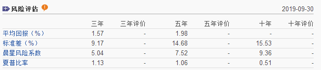

	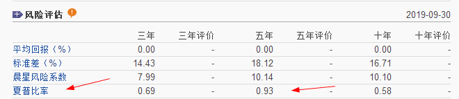

对比一下，上面是广发稳健的，下面是兴全趋势，显然广发稳健在过去的三年，收益大于风险，夏普比率很高。原因就是他有一半债券持仓。相对来说，最近三年行情不佳，兴全趋势的风险就会更大。

	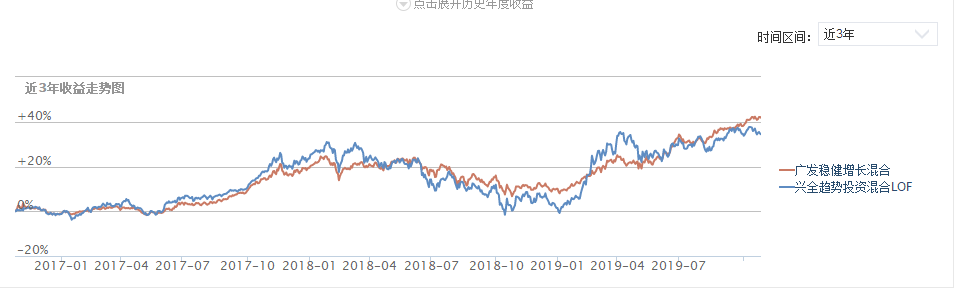

从走势来看也印证了这一点，现在广发稳健的收益更高一些，但从历史走势来看，广发稳健波动也更小。而兴全趋势在2018年底，几乎回撤的没有收益了。如果要是普通的投资者来说，显然广发稳健这种走势是更容易接受的。

	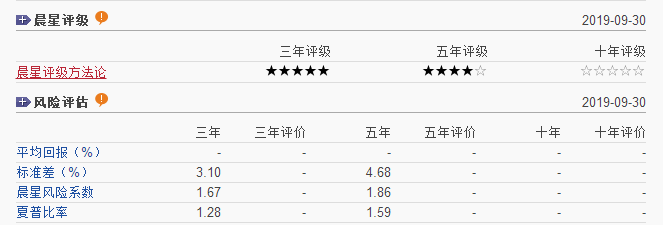

欧阳凯的工银双利债之所以一直强调夏普比率，是因为他做的足够好，工银瑞信双利债的夏普比率，比广发稳健还要高，但是从收益上来说，工银双利债的表现，肯定跟广发稳健没法比。

	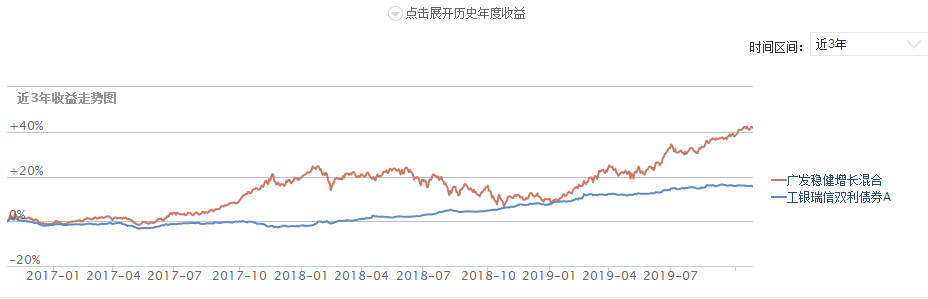

最近3年广发稳健涨了41%，而工银瑞信双利债才16%，但是如果要比风险回报，显然工银瑞信双利债会更稳定。几乎没有波动，而广发稳健，在2018年也面临全年回撤了7.86%

	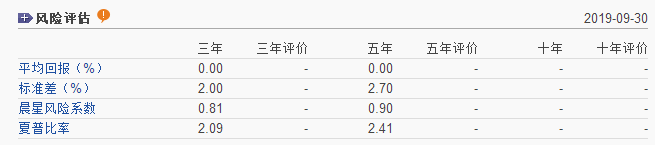

再看纯债，这是招商产业债的夏普比率，已经超过2了，说明什么，基本就不太可能亏钱。收益远大于风险。

	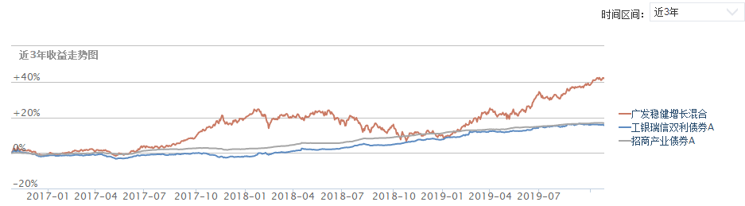

最近3年在收益上，招商产业债跟工银双利债几乎差不多，但是招商产业债，几乎连走平都没有，这就是以波动更小的方式，获得同样的收益，所以他的夏普比率就会更高。

那么这个夏普比率怎么用？

* 这是用于主动管理基金的指标，用来衡量基金管理者的风险控制能力，所以指数基金不在他的统计当中。

* 同类基金相互比较，可以选出更为优秀者。

	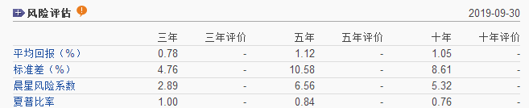

	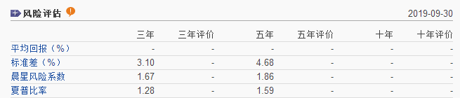

比如南方宝元债和工银双利债，都是二级债基，两个就可以比较一下夏普比率，工银双利债的夏普比率更高，显然就是他的走势更稳，风险也更小。

	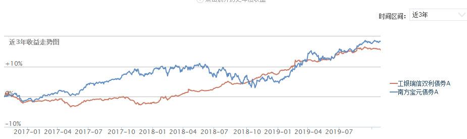

南方宝元债2018年的回撤还是比较大的，回撤幅度超过5%，而同一时间段，工银双利却是上涨的，3年收益差别不大的情况下，显然工银双利更容易坚持下来，投资者也更容易赚到钱。

* 不同类的主动基金进行比较，如果想做逆势投资的朋友，也应该关注夏普比率，一个好基金，夏普比率下降的很厉害，说明波动他很可能遭遇了挫折，受了重伤，反而构成了一个定投的好机会。未来收益可能会变大。比如国泰估值优势，三年夏普比率比五年夏普比率低了太多，说明这三年他波动过大。那么未来他的弹性可能会非常大。

	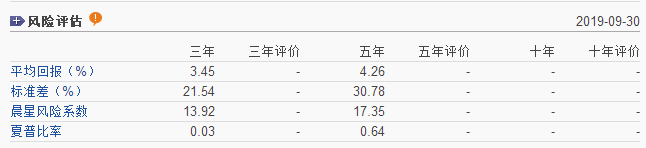

就像一个好学生，最近考试没考好，那么下次考试他排名提升的概率就会很大。

	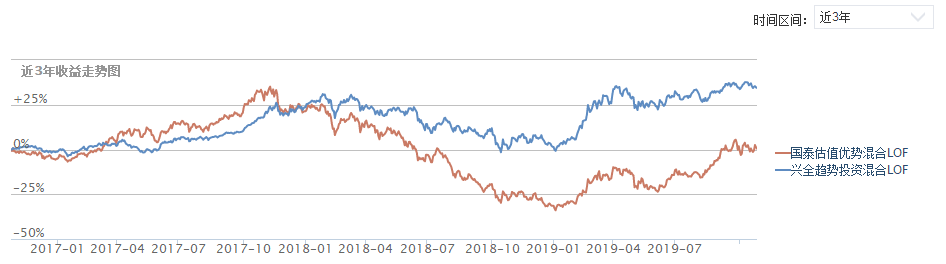

最近一段时间，国泰估值优势的弹性优势已经显现出来了。

* 小白投资者没有什么投资经验还想赚钱的，最好选择夏普比率高于1的基金，并且长期持有。通常情况下，夏普比率高于1的基金，都是债基，二级债基，或者最次也是股债均配的基金。