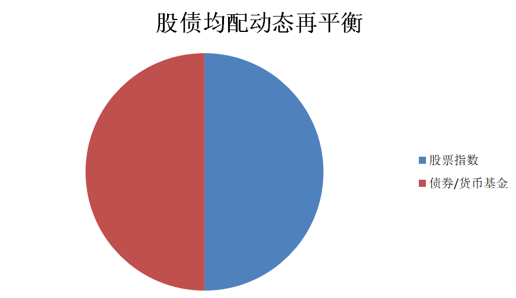
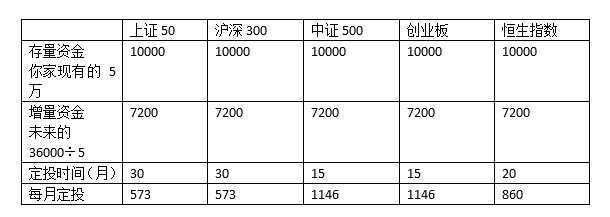

# 如何把定投策略跟资产配置相结合

一个最简单的股债均配的模型，策略非常简单就是股债各占一半。

	

首先，如果你用存量资金投资，比如你家就10万块钱富裕钱，就用这笔钱去投资，那么你可以一把配进去，现在就可以这么配置，5万买债券，5万买股票指数，债券最简单的方法就是广发纯债和新华纯债各买一半，股票部分上证50、沪深300、中证500、创业板再加上恒生指数，各买1万，这就拥有了一个股债平衡的配置，然后明年这个时候动态调整一次就可以了，股多了就卖股买债，债多了就卖债买股，这也是最简单的方式。

其次，如果你每月的工资还有一部分富裕钱，想用工资去做个定投，那么很简单，你就先用存量资金，把上面的股债均配做好，然后每月到手的富裕钱一分两半，按照股债的比例买进去就可以了。有人说我就1000块钱闲钱，你让我股票500，债券500，股票还得分到5个指数上去，真心不够最低标注那怎么办。这个也好办，你可以两个月一定投，或者看见股市跌了，就先买债再买股！又或者交替买股买债，甚至交替买股票指数，这些都可以，总之就是要按照比例放到资产的配置上去。不要干扰明年的股债在平，其实股债均配最核心的一点就是再平衡，这是一个客观上的低买高卖的过程。

第三，我不想一把买入，还想定投。你可以把你的账户分成两部分，比如你有10万，债券部分的5万直接一把梭，买入广发纯债和新华纯债，这个没什么可说的，债券缺乏波动性，不能做定投。而股票部分还剩5万，再加上你每月的工资，好比说能有2000元结余，你就把后面3年的钱算在一起，一年2万4，3年就是7万2，其中债券，3万6，股票3万6，债券的每月1000你就分两份，广发纯债和新华纯债各买一份，股票的部分，你要用3万6加上现有的5万，就是8万6，把它分成24分，那么每一份就是3583元，也就是说那五只指数基金，你每月每只可以买700元，剩下用不到的钱，都买成货币基金，市值计入股票账户。第二年用这个总额跟债券进行再平衡。如果一路定投一路亏，那么明年就要从债券中调出一部分资金了，这时候再重新估算股票账户的份额，你的定投也就可以增加了。

第四高级玩法，分账户，差别比例的定投。还是把你的账户分成5部分，债券这边分成新华纯债和广发纯债的两部分，5万全买进去，每月的收入2000，还是拿出1000去投债券，股票那边再分。股票这边，分成3个账户，大股票，小股票，海外股票。中小创已经调整较大，要加快建仓，给15个月比较保守了，而沪深300刚刚高位跌下来，所以需要建仓的时间长一点。

	

之后就是跟上面的第三条一样，用不了的钱都放到货币基金里面，然后跟随资产账户一起统计。每年动态再平衡，让整个股债配比相等，也让风格指数保持该有的配比。