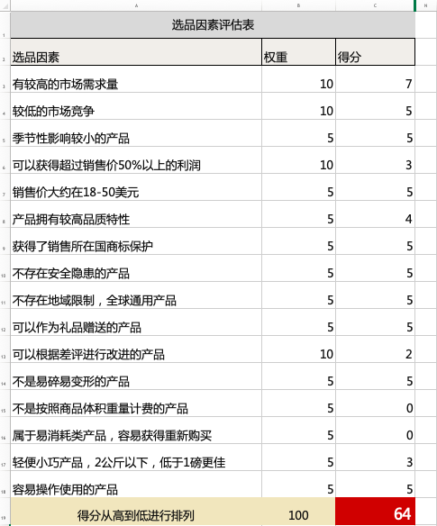

# 多维度解读跨境电商独立站

<!-- toc -->

经营跨境电商独立站，需要解决诸多方面的问题，例如：语言障碍、网络访问障碍、收款障碍，物流运输障碍等；此外，流量获取则是独立站成功与否的重中之重，而流量来源无非集中在：Google、Facebook与YouTube。

## 建站的3大主流方式

	

三大建站方式占据了独立站市场总量的56%，至于图中展示的Other所占高达38%的原因无非就是某些平台自己开发独立站系统，比如苹果。

### WordPress WooCommerce

[WooCommerce](https://wordpress.org/plugins/woocommerce/)实际上是WordPress的一款开源电子商务插件。它和WordPress一起工作，由于开源特性，你可以自由扩展网站的各个方面，让你拥有自身店铺的绝对控制权，数以万计的免费和付费WordPress扩展插件提供功能支持。WooCommerce插件由WordPress官方团队Automattic负责更新维护。

WooCommerce基本包括了在线商城所需要的功能，产品列表，购物车，商品类目，会员功能，支付功能，库存管理功能，销售记录功能，还有优惠券功能等等。通过简单的配置可以迅速搭建起一个电子商务网站。

### Shopify

Shopify一个让用户自主管理在线商店的平台，本身并不参与卖货，也不处理打包发货仓储这些事情。Shopify可以被理解为一个电子商务网站的自助搭建平台。卖家在Shopify网站上注册一个店铺账号，通过系统内置的一系列模版和程序，绑定自己的独立域名，即可完成整个独立网站的搭建，卖家只需要按月支付最低29美元的平台使用费用即可。

Shopify的特点即是简单易用。卖家不必懂得如何编程，如何设计网页。卖家所需要的东西，Shopify都帮你准备好了。熟练的卖家完全可以在一天时间内利用Shopify搭建出一个足够专业美观，功能齐全的品牌电子商务网站。

### Magento

作为全球功能最强大的电商开源程序，Magento能做的事情是其他任何一个开源电商程序所无法比拟的。Magento可以做多店铺平台、可以做多语言电商门户、可以多币种多收款渠道接入支付、可以API无缝对接各类ERP系统等等。Magento适合规模化电商网站，适合海量SKU，并不适合新卖家或者对技术方面并不熟悉的卖家。

## 主体身份

独立自建站对于经营主体身份并没有过多的限制，无论是个人、国内公司、香港公司、美国公司都可以运营独立站。独立站没有门槛、更加自由的特点也让很多个人卖家能够快速上手。当然，独立站运营上的很多细节工作也受运营主体身份限制，比如可信度方面，显然个人身份和美国公司身份有明显区别；比如收款方面，能否接入Stripe收款，比如营销推广方面，要知道很多渠道并不接受个人身份，等等。

### 中国公司

中国公司身份是目前国内卖家使用的最多的运营主体，但因为独立站收款环节，也会收到很多限制。比如无法接入Stripe信用卡收款通道，比如PayPal收款后，美元外币得提现到国内银行对公账号，对公账号就少不了开美元账号，这又涉及到银行监管备案之类的琐事。实际上也没多少人真的这么做，一般PayPal收款后，提现美元到Payoneer账户中，再转人民币到国内，减少不必要的麻烦。

### 香港公司

香港在“国际贸易自由”及“监管”上的上佳口碑，排列全球首位。最近fraser institute新公布的《世界经济自由度2019年度报告》中，香港再获评为全球最自由经济体，这种自由不是随便说说而已，而是体现在方方面面。当然，香港公司的注册与维护成本又会比国内公司要高的多。

### 美国公司

在跨境电商行业，美国公司身份是最有价值的运营主体。你不能入驻的平台，美国公司可以入驻；你不能开设的收款通道，美国公司可以开设；你不能销售的品类，美国公司可以销售。当然，从信誉角度来说，以美国公司身份本土化开设经营的独立自建站更能够让客户信任。

### 个人

个人身份的自由度如同独立站的特点一样，进可攻，退可守。特别是结合Dropshipping方式来做，不用自己备货，不用自己打包发货，不用注册公司，经营风险也会小很多。但个人身份实在谈不上专业，也不适合以此为主营业务的跨境电商专业卖家。实际上，个人身份经营更加适合刚入门，试水跨境电商独立站。

## 两种经营模式

### 常规站点

常规站点是比较中规中矩的做法，适合专门销售自己品牌的产品或者干脆大量铺货的产品，可以理解为品牌专卖店或者杂货铺。

### 商机站点

商家站点也叫利基站点，英文名Niche，是众多跨境电商独立站卖家的选择。简单点说，Niche站点所销售的产品是通过选品软件或按照一定的选品策略，从行业细分市场中精挑细选出来的那些市场需求相对较大、竞争相对较小的产品。也就是根据选品来建站，根据选品来做推广的一种站点。这也是目前跨境电商独立站市场上采用最广泛的建站策略。

商机（利基）站点的好处很多，其最核心的要点在于选品。选品的好坏也决定了站点的生命周期、销售量以及收益情况。选品并没有绝对的标准，不过我们还是习惯性的列出一些参考依据，试图在开始时就减少选品错误到来的风险，比如：

	

## 两种主流收款方式

### PayPal

PayPal是全球范围内使用量最广泛的在线收款工具，没有之一。

PayPal是名副其实的舶来品，时至今日，仍然如此。PayPal早在2004年的时候就进入中国，成立了美银宝信息技术（上海）有限公司。不过受金融牌照政策与本地化策略影响，PayPal发展迟缓，始终未能在中国市场有所突破。

### Stripe

Stripe由来自爱尔兰的Patrick Collison与其弟弟John Collison在2010年创建，总部在旧金山。Stripe专注于网络支付，为中小型企业和个人提供在线支付服务，通过收取费率和手续费方式盈利（每笔交易收取2.9%费率 + 30美分统一手续费）。

对跨境电商卖家来说，Stripe为跨境电商自建站提供了高效便捷的信用卡收款方式。但很可惜的是，Stripe的这项服务并未向中国开放，也就说，如果你想使用Stripe的信用卡支付渠道，还得想点办法。

## 仓储发货模式

### 自备货自发货

自备货意味着提前采购，准备仓储场地，必要的成本投入；自发货意味着需要花费时间精力去打包发货；而订单不多的话，物流价格也不会有什么优惠；而当你经营一段时间后，会逐渐累积起越来越多的库存，产品也会出现滞销。

### Dropshipping发货

Dropshipping代发货模式是一个比较受跨境电商卖家欢迎的商业模式。不需要高昂的启动资金、不需要提前备足库存，不需要自己打包发货，管理也很灵活方便。当然，Dropshipping同样也有一堆的缺点，所以，当你的Dropshipping业务已经达到了一定高度的时候，通过自备货自发货方式反而能降低更多成本、保证物流时效以及保障产品品质，提高客户体验。

## 引流渠道

新建的独立站本身并没有流量，也谈不上出单。引流是独立站工作的重心，是重中之重。如何引流并没有什么标准答案，但大多数流量来源集中在Goolge、YouTube、Facebook三大巨头，当然，还有很多其他的，像reddit.com、pinterest.com、instagram.com、wikipedia.org、quora.om等等。流量又分了免费流量和付费流量，独立站想要快速出单，大多得依靠付费流量达成，多数卖家耗不起Google SEO的自然流量，这得依靠日积月累的网站权重、高质量外链以及迎合极其复杂的google seo算法对网站和内容所做出的各种改进工作。

## 几点误区

### 建站太复杂了

实际上，建站并不是复杂。使用Shopify建站只需要十几分钟；而使用WooCommerce建站方式对于没有代码经验的人来说，参考教程也能很快搭建成功。

### 独立站就没有侵权风险了

不少卖家搭建独立站的目的就是为了做仿品，平台不让卖的或者要严格审查的，或者要商标授权的，独立自建站都可以卖。但是，必须得明确，独立站同样是存在侵权风险。如何你使用的Shopify这种SaaS平台搭建独立站，就尽量侵权产品远一些，Shopify因为侵权封账号可从来不手软。Shopify和亚马逊一样，有着严格的商品销售政策条款，禁止销售任何假冒伪劣、危害性、或违反当地市场法律法规的产品。同样，也接受权益人的投诉，或对其他人的投诉进行申诉。

至于WooCommerce，虽然没有Shopify那么严格。但网站同样会因为侵权行为，被权益人律师函或者向美国法院申请临时禁制令要求服务器提供商关闭网站，要求域名注册商停止解析，要求PayPal、Stripe等收款通道冻结账号等等。

### 网站缺胳膊少腿

社交媒体链接、字体样式、英文大小写、隐私政策、退款政策、地址电话沟通方式等等细节能反映出独立站的精细化程度，这些东西是最容易被独立站卖家们忽略的，而往往这些东西直接影响到网站的信用度以及订单转化率。当你真金白银付出大量广告成本进行站外引流时，发现只有流量，却没有订单，低的出奇的转化率让人怀疑人生。如果这时候，你再回过头来检查一下网站的这些看似不起眼的基础，就不难理解转化率为什么这么低了。

## Dropshipping采购

Dropshipping是独立站经营的一种方式，Dropshipping用户比较多的会通过速卖通采购，但很多卖家会碰到速卖通并不支持国内的信用卡支付，无法完成速卖通下单采购。

### 拍住赏Tap&Go虚拟卡采购

拍住赏是香港电讯集团旗下的HKT Payment Limited公司推出的一款电子钱包，中国大陆的用户可以通过手机app申请，并自动签发万事达和银联两种虚拟卡。然后，你就可以拿着这个万事达虚拟卡在速卖通上下单采购了。

### Payoneer万事达实体卡采购

Payoneer已然成为中国跨境卖家必备收款工具，无论是入驻平台收款，还是独立站收款，甚至速卖通采购，Payoneer都能轻松搞定。申请Payoneer账户没有门槛，几乎任何人都可以免费申请。但要获得Payoneer签发的万事达实体卡，则必须账户内要有40美元余额。Payoneer签发的万事达实体卡有激活费、年费，实际上并不便宜。

另外，Payoneer的美国银行收款账户可以用来PayPal账户余额提现。独立站采用PayPal收到的钱，无论是个人还是企业开的PayPal，都可以提现到Payoneer的个人账户上。这时候，你就可以用Payoneer实体卡在速卖通上采购了产品了，或者直接提现到国内的个人银行账户。

### 其他外币信用卡或借记卡采购

应该说，大多数海外银行签发的信用卡或者借记卡都可以在速卖通上下单采购。实际上，速卖通也并非故意要拒绝Dropshipping卖家合理的下单采购需求，猜测其主要原因还是为了避免速卖通卖家刷单，境外的卡片至少能提高一些刷单的门槛，所以，比不太担心下单采购被拒的情况。据了解，速卖通也向一些第三方的合作服务商开放了批量下单采购的API通道，方便Dropshipping卖家采购。