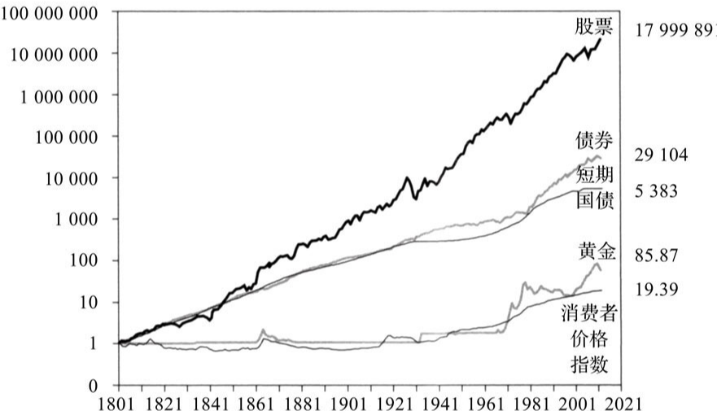

# 复利的力量

复利被称作是人类历史上最伟大发明，是人类第八大奇迹，但是这个东西绝大多数人感受不到，因为太多的人都等不起。所谓复利，就好比你拿1000元投资，年化收益是10%，那么第一年你的本金就变成了1100元，而第二年你还是10%的收益，就赚了110元，于是总账户就变成了就变成了1210元。公式其实就是1000元本金×（1+10%）的多少次方，之后的多少年就是多少次方，学过一点数学就知道这个指数函数的威力。

算一笔账，比如年化收益10%，持续20年，那就是1.1的20次方，结果就是6.72倍，也就是说你在今后的20年，本金增长了6.72倍。原来的1万变成了6.72万，原来的10万，变成了67.2万，那么30年呢？结果是17.5倍，40年是45倍，50年是117倍，所以你看见了吧，复利越到后面，就会呈现出爆发式的增长。那么20%的年化增长呢，在10年增长6.2倍，20年增长38倍，50年的时候，就是惊人的9100倍。

| 年化收益率 | 10年 | 20年 | 50年 |
| ---- | ---- | ---- | ---- |
| 10% | 2.6 | 6.72 | 117 |
| 20% | 6.2 | 38.33 | 9100 |

西格尔教授，就是写股市长线法宝的那位，他做过统计，1800年你投下1美元在股市上，到2013年你将拥有1800万美元，远远将通胀抛在身后，可见复利的力量，越到后来越是惊人，而债券只能最后拥有29100美元，相差了近千倍，国债就更差了，只有5383倍回报，黄金只有85倍回报，这还是在金本位解体的情况下才出现的。而物价则涨了19倍，换句话说1美元如果不投资，200年后购买力下降95%。

当然没有人可以活200年，所以你一生也不可能产生1800万倍的回报，50年增长50倍就已经算是很不错的成绩了，意味着年化8%，而50年100倍，意味着你基本要实现年化10%，而现在很多人一张嘴就是要追求年化15%的增长，那么你知道这是一个怎样的成绩吗？意味着你将得到50年1000倍的回报。换句话说，年化收益差5%，50年坚持下来，收益差了10倍，这就是复利的力量。

	

反过来算，如果你想20年实现50倍，那么你的年化得达到22%才行，这几乎是巴菲特的水平，几乎不可能实现。20年20倍，都要达到17%的年化才行。所以算算你的目标吧，你到底要赚多少钱？然后制定一个比较保守的财务自由目标，和一个相应的复利标准。

举个例子，张三月收入2万，媳妇月收入1万，有房有车有房贷，月开销2万，目前有存款50万。他要想实现财务独立，至少需要每月有2万，一年24万的财务收入才行，而按照安全的算法，总资产的3%，是你可以用来做消费提取的，换句话说，张三他们家必须得有800万才能够实现财务独立。50万增长到800万，需要增长16倍，如果是年化15%的增长，他需要20年，如果年化10%的增长，他需要30年。如果他要想让财务独立的日子更快实现，那么他就必须要压缩开支，多拿出盈余来投资，同时保持一个较高的收益率。比如他每个月结余1万，第一年就是12万，这12万在按照10%的年化增长，在未来19年可以贡献61万，而第二年剩下的12万，可以在未来18年贡献55万。以此类推，即使他的年化收益只有10%，把每月结余都拿出来投资股票资产，或者做投资组合，他也大概只用不到20年就可以实现财务独立。

更何况张三好好努力，他未来还有升职加薪的机会，可以把更多的钱拿来投资，而且月支出两万元，已经是一个非常高的支出标准了。一旦他还完房贷，可能支出就会大幅下降，届时又可以节省一笔支出，从而让支出更少，财务自由的门槛也就更低了。所以，每个人其实都有机会实现自由和晚年幸福。而且每年10%的收益并不很高，或者说你只需要现在买入并持有20年，基本上就是市场平均收益。

所以别为追求高回报而冒险了，稳稳的通过复利，过上衣食无忧的生活，这种事努努力很容易实现。反而是追求高回报，来回折腾，让复利中断，才是最大的风险。但很可惜90%的人到死都不会明白。不折腾！这三个字蕴含的智慧。