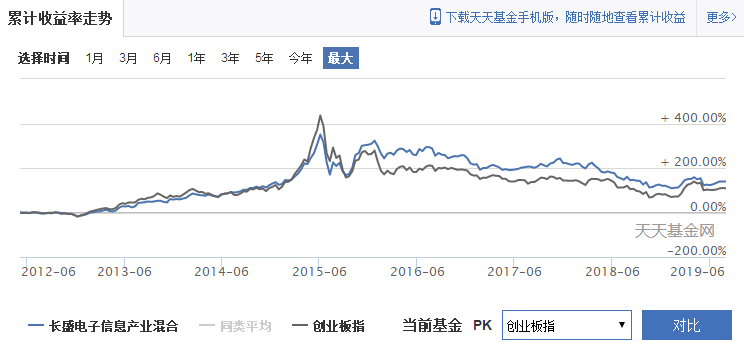
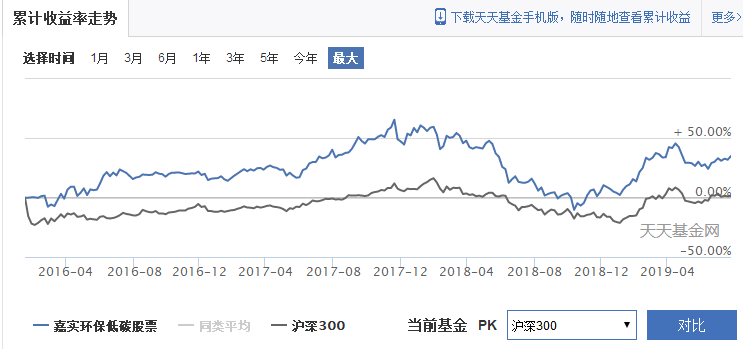

# 各行业优秀的股票和基金

<!-- toc -->

## 银行

代表公司： 工商银行、建设银行、农业银行、中国银行、招商银行、兴业银行。

代表基金(场内)：华宝中证银行ETF(512800)。

代表基金(场外)：鹏华中证银行指数(LOF)(160631)、招商中证银行指数(161723)、天弘中证银行ETF联接A(001594)。

	

投资方法：

* 银行见底有着明确的标志，就是工农中建达到0.7倍pb，一旦出现这种情况，就表示出现了安全边际，现在中行达到了但是工行没达到，所以可能银行接近底部区域，但是并非是特别低估。有可能下面还有再跌10%-15%的空间。
* 银行这种东西是当类债券的投资工具用的，比如现在买有5%的分红，已经高于了一般债券，买来以后你可以就吃分红，不顾股价，适合于需要现金流的人。
* 银行的投资没必要买基金，因为一共就几只，哪只基金做配置，他也得买这几家银行，只是配比不同。
* 投资银行行业，长期回报肯定低于指数回报。银行是波动性最低，收益也最低的行业，没有之一。

## 证券

代表公司：中信证券、海通证券、国泰君安、华泰证券、招商证券。

代表基金(场内)：国泰中证全指证券公司ETF(512880)。

代表基金(场外)：申万菱信中证申万证券行业指数(163113)、富国中证全指证券公司指数(LOF)(161027)。

	

投资方法：

* 证券有明显的反身性，一般都是右侧追击，而不进行左侧布局。
* 反身性会让他越跌业绩越差，越跌估值越高，相反越涨业绩越好，越涨估值越低，所以当你看到证券行业业绩大增，往往是整个市场见顶的标志，证券行业业绩暴跌，恰恰是市场见底的标志。
* 如果非要找证券行业的底部，有一个简单的办法，可以大概估计。那就是中信、海通、国泰君安这种大券商跌破每股净资产，一般就是证券的底部。再下跌的空间也就有限了，但招不是特别准。需要多家券商验证，比如上面说的那三家都跌到净资产附近了，基本也就差不多了。
* 证券行业有很强的周期性，不适合长期投资，所以有人一说要长期投证券行业，你就知道他根本就是个外行。

## 保险为代表的非银金融

代表公司：中国平安、中国人寿、中国人保。

代表基金(场内)：易方达沪深300非银ETF(512070)。

代表基金(场外)：鹏华证券保险指数(LOF)(160625)。

	

投资方法：

* 保险跟证券略有不同，除了投资的反身性，还有因为是传统业务，所以可以左侧投资。
* 保险的走势跟大盘走势基本一致，所以大盘到底了，保险就基本可以投资了。一般保险公司的投资，都是选择在股灾之后入局。然后长期持有。
* 保险公司业绩也有周期性，并不会利润一直增长。比如现在中国平安的业绩就太好了，好的已经很难持续了。

## 有色金属、稀土

代表公司：紫金矿业、山东黄金、天齐锂业、方大炭素、江西铜业。

代表基金(场内)：南方中证申万有色金属ETF(512400)。

代表基金(场外)：国泰国证有色金属行业指数(LOF)(160221)。

	

投资方法：

* 有色金属是强周期行业，必须看他的基础金属走势，比如要买山东黄金，就得关注金价，买天齐锂业就要关注碳酸锂价格，买云南铜业就得关注伦敦铜，股价和基础金属的价格相关性很高。
* 整个行业的投资，首先要看铜价是否抬头，其次看PPI是否上升，最近铜价已经逐渐恢复，特别是波罗的海指数BDI快速反弹，说明需求开始上升，那么有色金属的价格回升应该是大概率事件。不过伦铜的表现和PPI的表现都还不明显，还需要耐心等待。
* 有色金属是典型的经济强周期，也是不能长期投资，必须要顺势而为。在业绩最好的时候离开，在业绩最差的时候逐渐布局。

## 食品饮料、消费行业

代表公司：贵州茅台、五粮液、海天味业、伊利股份、格力电器、美的电器。

代表基金(场内)：汇添富中证主要消费ETF(159928)。

代表基金(场外)：易方达消费行业股票(110022)、招商中证白酒指数(LOF)(161725)。

	

投资方法：

* 从长期来看，最好的投资对象就是消费行业，而消费行业里最好的投资对象就是白酒，长期涨幅长期跑赢指数。
* 这个行业是弱周期行业，更应该长期持有，而不做短差。买的便宜，是最重要的投资之道。一般都是在出现一些负面消息的时候，是布局这个行业最佳时机。
* 他们的估值波动区间非常稳定。算出历史估值最低点，基本就具备安全边际。总之就是有迹可循，一般用PEG估值，PE不能高出可持续的增长率太多。

## 医药生物

代表公司：中国医药、恒瑞医药、同仁堂、华东医药、云南白药、长春高新、华兰生物、爱尔眼科、通策医疗。

代表基金(场内)：易方达沪深300医药ETF(512010)。

代表基金(场外)：申万菱信中证申万医药生物指数(LOF)(163118)、汇添富医药保健混合A(470006)。

	

投资方法：

* 医疗是典型的弱周期，一般在需要稳定的业绩的时候，才会投资医疗。医药的估值通常比较高，可以用PEG估值，通常能给到1.5-3倍的PEG。因为他的周期比较长，比如100年以后同仁堂大概率还存在，但腾讯阿里却不好说。
* 医疗生物的表现时机往往晚于大盘，在市场见顶之后，医疗还有一段表现时机。所以一般是防守周期，才去投资医疗。
* 医疗可以长期持有，其实医疗长期持有的结果应该好于消费，因为医疗生物的消费刚性更强，但是在中国A股目前来看，医疗表现弱于消费。未来长期的预期收益率不低。
* 医疗表现差的时候，往往是周期走强的时候，比如2016年这一波周期复苏，医疗表现较差。也就是说，在没什么可投的情况下大家才会选择医疗，在强周期的时候，医疗会被淡忘。

## 国防军工

代表公司：中国重工、航天电子、航发动力、中航飞机、卫士通、中国卫星。

代表基金(场内)：国泰中证军工ETF(512660)、广发中证军工ETF(512680)。

代表基金(场外)：前海开源中证军工指数A(000596)、富国中证军工指数(LOF)(161024)。

	

投资方法：

* 军工企业的投资基本都差不多，也就那么几家企业可以选。所以基金的业绩表现类似。
* 军工只有在大牛市才有机会，通常都是并购重组比较活跃。
* 不能长期持有，因为大部分公司，没有业绩。
* 这个行业也没法估值，都是2B业务，而且相当不稳定。所以就不用费劲看什么财报了，就想想是不是大牛市就可以了，没有大牛市预期千万别买。
* 当银行到处推荐军工基金的时候，说明牛市即将结束。

## 传媒、互联网

代表公司：东方财富、分众传媒、网宿科技、东方明珠、万达电影、华谊兄弟、光线传媒。

代表基金(场内)：广发中证传媒ETF(512980)。

代表基金(场外)：鹏华中证传媒指数(LOF)(160629)。

	

投资方法：

* 传媒的风格在于中小创的成长上面，这几年整个市场的风格都在价值上，所以传媒表现相当惨淡。
* 传媒业绩有明显的行业周期特征，最近反正是受到各种利空消息的影响，估值已经跌破历史估值底部，但仍然不知道什么时候能够回升，目前看不到希望，跟整个的大环境有关。
* 传媒主要靠外延并购获得业绩增长，所以他的估值意义并不大，需要行业整合，才能推动估值提升，算他的现金流和利润，意义不是很大。但行业整合，也往往发生在这个版块走牛的时候，这样外延增长才能反应在市值上。
* 所以传媒是一个反身性行业，跟券商类似，牛的时候会很牛，熊的时候会很熊。现在恰恰就是四面楚歌的时候，感觉喝口凉水都塞牙。
* 这个版块最好做右侧趋势投资，不要做左侧逢低布局，因为你找不到估值底。

## 电子、计算机

代表公司：海康威视、科大讯飞、恒生电子、大华股份、三安光电。

代表基金(场内)：广发中证全指信息技术ETF(159939)。

代表基金(场外)：长盛电子信息产业混合(080012)、天弘中证电子ETF联接C(001618)。

	

投资方法：

* 电子主要通过业绩增速估值，利润不会有多少。
* 更倾向于中小创，在大牛市里跑不赢指数，但是防守的时候比指数强一点有限，需要有市场中成长风格的配合。
* 有很广阔的业绩想象空间，但编编故事还行，不一定能兑现。所以当你发现一个特别美好的故事的时候，千万别太当真。
* 行业基金其实表现一般，冒了很大的风险，但其实总体上，也就跟中小创指数差不多，所以不如只配中证500+创业板。

## 环保、低碳、新能源

代表公司：上海环境、阳光电源、天顺风能、启迪桑德、伟星新材、亿纬锂能、隆基股份。

代表基金(场内)：广发中证环保ETF(512580)。

代表基金(场外)：嘉实环保低碳股票(001616)。

	

投资方法：

* 曾经环保风光过，但是2017年下半年以后就非常惨淡。这个行业主要靠政府给钱，政府一旦没钱了，环保业绩就会大幅回落。
* 政府是其大客户，但并不稳定，经常拖欠资金，所以让企业利润很不稳定，估值几乎无法计算。
* 主要看经济周期，基建扩张的时候，环保行业大有所为，一旦政府预算收紧，环保行业就会比较惨淡。