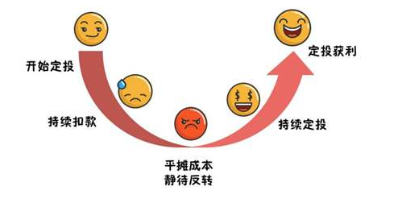
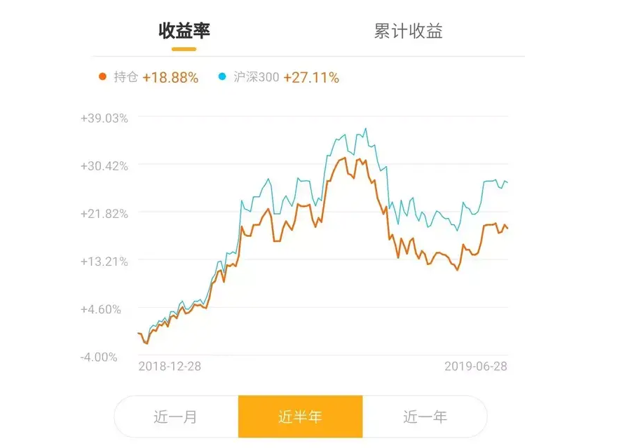

# 左侧定投

首先，我们以最低点为中心，把行情分为2类，一类是左侧，一类是右侧，简单来说就是下面这张图。而我们的定投，只适用于估值低估的左侧下跌行情，如果进入了右侧上升行情，那么定投就不适用。

	

其次，之所以这样，是因为定投的性质决定的，定投的核心是什么？就是不断的买入摊低成本，然后在涨起来之后，投出微笑曲线，最后产生收益。所以重点是**摊低成本**四个字，那么什么时候才能摊低成本呢？当然是不断下跌的时候才能摊低成本，如果开始上涨，你再开始定投，就会不断抬高成本。

	

那么是不是到了右侧就不能定投了呢？如果你之前一直做定投，那么注意止盈不止损，到了右侧寻找20%年化收益止盈的机会，一旦止盈就可以转入资产配置，此时转配置的收益应该更高，也能够保护利润。而如果你之前没有投资，那么到了右侧就不要再去定投了，在右侧定投的效率就很低了。最后就是小赚大赔，等你资金仓位重了，市场也就到顶了，所以这就跟定投的初衷完全相反了。

	

如果从去年下半年开始定投，这是一个明显的左侧下跌行情，市场低估，有很好地安全边际，不断的定投下来，其实要明显跑赢指数，到了今年上半年就有了很清晰的止盈机会，最高可能到了盈利25%左右，要明显好于指数。但是如果你没有止盈，那么就会跟随调整，拿到6月底，盈利只剩下了12%，但即便这样，也比一把买入指数强。

	

但是如果我们把周期调到半年，这半年就是一个明显右侧行情了，我们再去定投会发生什么事？我们会发现，在市场快速上涨的时候，由于我们是分批买入的，根本跟不上指数的涨幅，等到指数回调了，由于我们的仓位变重了，所以回撤更大，最后下来就是远落后于指数的涨幅。

注意这两张图是非常乐观的算法，没算整体账户差异，只是用定投的收益跟指数的涨跌幅作对比，而现实中，如果你要用定投和一把买入的所对比，那么差距还会更大。因为你有大量的钱是闲置在外的，而我们知道，现金和股票的相关性是-1，所以最后对比出来的趋势会更明显，左侧定投的优势更大，右侧定投的劣势也更明显。

所以：

* 1、分清楚左侧还是右侧，纯粹的定投只有在左侧下跌且低估的环境下才能开始，而且要坚决执行止盈不止损。
* 2、右侧行情下，定投存在硬伤，会是一个大概率赔钱的策略。很多专家都在无厘头吐槽定投，说定投不好，主要是他们把右侧定投也统计其中，而且还不止盈，这样就严重浪费了定投的效率。
* 3、配置的方法适合左右侧的低估区域，但在左侧显然不如定投更有效果，所以配置的实力更加平均，我们要做的就是让效率最大化，在明显的左侧用定投，而到了右侧，止盈后尽快转配置，避免落入青铜陷阱，这样比你傻傻的做配置要强不少。
* 4、定投和分批建仓是有区别的，定投至少留出12-24个月，遵循年化20%止盈但不止损的定律。而配置中的分批建仓，通常3-6个月完成，激进的快一点，保守的就慢一点，建仓之后不遵循年化20%止盈，配置后的股票仓位就一直持有，除非市场过分高估，否则轻易不再退出市场。
* 5、债8股2这种偏债基金一般不用定投，一把买入就好。如果想保守一点可以3个月建仓。建仓后也不遵循20%止盈,一直持有下去。股票占50%以上的基金，才可以用定投,股票比例超过8成的，就类似于股票基金和指数基金。