# 明星基金经理

<!-- toc -->

先贴一个表，这些基金经理都是任职时间非常长，且收益很稳定的；也就是说，至少穿越过牛熊，可以信赖的基金经理，他们手下的很多基金，梳理一下。

	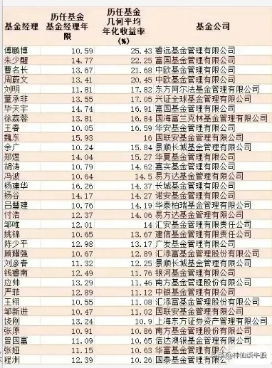

## 傅鹏博

傅鹏博，任期10年，年化回报超过25%，现在是睿远成长价值的经理。

	

最近一年半的时间，睿远成长价值回报翻倍，业绩表现在今年3月份之后，开始明显跑赢大盘，但是基本与创业板保持一致。不过傅鹏博的防守，显然比指数更强，每次都基本能跟上创业板的涨幅，而回撤的时候，幅度小于指数。可见傅鹏博确实厉害，去年他以万众瞩目的姿态发行睿远成长，今年依旧能不辜负所望，相当不容易。一般的经理在盛名之下，很难做出业绩。

	

	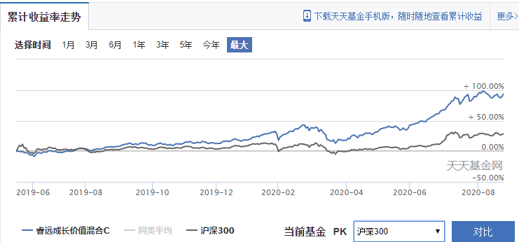

不过最近这个基金在一个明显的调整当中，单看最近一个月表现一般，未来一段时间估计仍然以调整为主，不过他现在目前可以赎回，但是不开放购买，所以我们也买不到。等过一阵，调整一阵，可能规模下来之后，就会开放购买了，可以耐心等待。

## 朱少醒

朱少醒，从业14年，年化回报22%，手下也只有一只基金，就是富国天惠成长混合，15年18倍，相当了得。朱少醒一直就在这只基金当经理，这种现象，在基金行业极其罕见。

	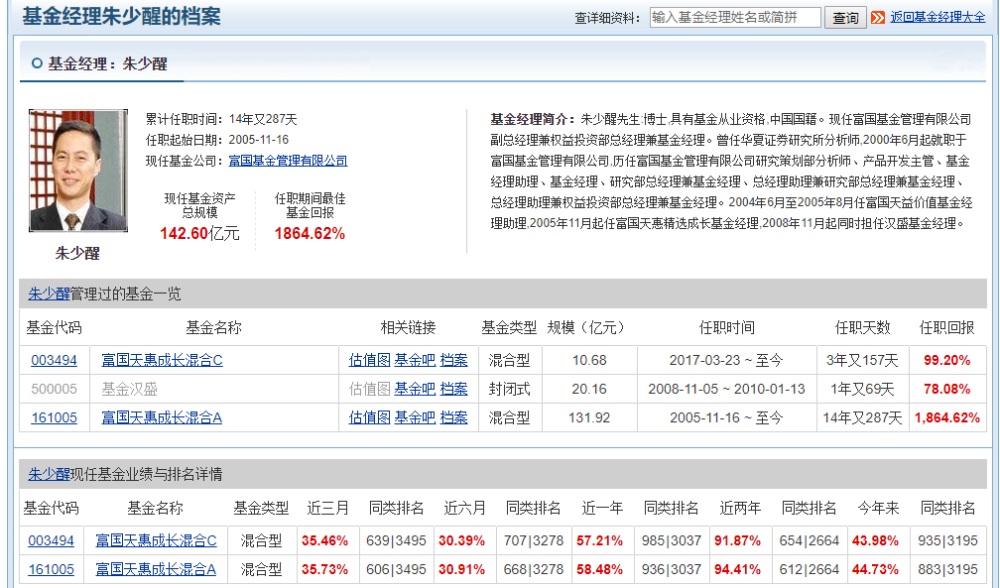

	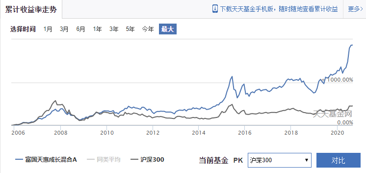

	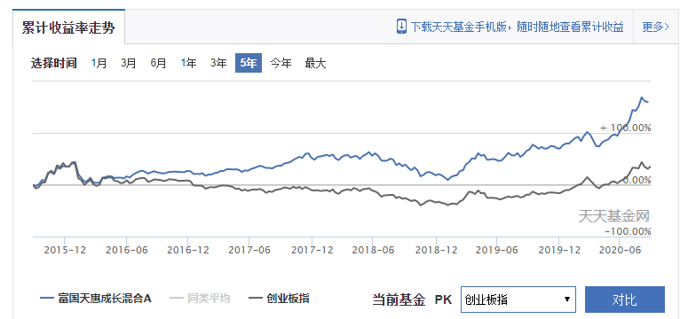

从富国天惠成长的表现来看，他最近也是偏向成长的，而且他似乎在2017年的时候，就已经做了成长布局，以至于2018年回撤没有控制好，成为了一个败笔，不过2019年1月到现在，基金基本翻倍。也早就创出新高，说明了逆向投资的价值。而且最近，他的防守也不错，表现出了一定的抗跌性。朱少醒的基金，蓝筹与成长兼顾，哪边有机会，他就倾向哪边。2013年的成长，2017年的价值，2019年的成长，都捕捉的很到位。未来这只基金，趋势也依旧是跟随指数调整。等中期调整结束之后，到时候再看看，是否有机会。

## 曹名长

曹名长，中欧基金，是13-14年的老人了，年化收益20%以上。

	

曹名长手下的基金比较多，最大名鼎鼎的就是中欧价值发现，也是一只2009年的老基金了，但是这只基金最近表现不佳，最近两年甚至没有跑赢指数。主要的收益，基本都是2018年之前积累的。2019年之后这波上涨，他的参与度很低，无论是大盘股还是成长股，中欧价值发现，都没跟上。

	

	

今年以来，才稍微找到点感觉，7月13日，市场见顶以后，中欧价值发现，反而找到感觉了。最近一个多月市场指数调整，而中欧价值已经开始创新高。

	

## 周蔚文

周蔚文，中欧基金，是13-14年的老人了，年化收益20%以上。

	

周蔚文的旗舰基金是中欧新蓝筹，和中欧新趋势，基本差不多，都是12年近6倍的收益，

	

	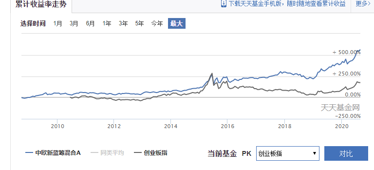

从表现来看，周蔚文现在的表现，要比曹名长更好，他不但在2019年后的这波行情中，跑赢了沪深300，也跑赢了创业板，虽然都属于是中欧系的基金，但是持仓大不一样。

	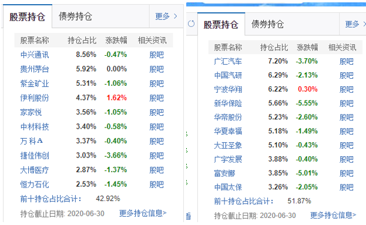

左边是周蔚文的，右边是曹名长的，几乎没有重合。这在一个公司之下，很少出现这种现象。周蔚文的基金也同样很抗跌，创业板近期的调整，几乎对他没什么太大的影响，最近也很可能创出新高。如果做个比较的话，可能更倾向于曹名长的基金，中欧价值发现，这几年他的表现糟糕，他的重仓股，也更多都是冷门股，所以可能在最近的调整中更加安全，未来的潜力也更大。

## 刘明

东方阿尔法基金，他手上的基金叫做东方阿尔法优选还有东方阿尔法精选，他是2018年刚刚跳槽到东方阿尔法公司的，以前他最为出名的是掌管着封闭基金景宏，还有大成优选。

	

其中主要业绩都是来自于基金景宏，3年4倍，赶上了大牛市，人家走的时候也刚刚好，所以业绩了得。后来做大成优选就有点生不逢时，2007年到2012年5年还亏了不少，现在跳槽到东方阿尔法，一开始业绩也是不温不火，今年才开始出现净值拉升，最近半年明显跑赢沪深300指数。

	

	

为什么这样呢？用他的走势跟创业板一对比你就明白了，走势跟创业板几乎一毛一样，也就意味着，这只基金的风格偏向中小创，风格压对了，也就跑赢了指数，拿到了不错的收益。

值得重点说的是，这只基金目前规模不大，所以未来应该比较有潜力，而他的投资逻辑是自上而下的，从宏观到微观，先确定资产比例，然后再优选风格，刘明当年在做大成优选的时候，也曾经重仓银行地产和格力，所以我们可以判断，他还是比较善于把握风格趋势的。当然这种灵活多变，有时候也是一把双刃剑，做好了会有超额业绩，做不好反而不及大盘。从他之前的表现来看，基本还是能踩准风格的节奏的。而在选股上，他基本也是跟踪指数，不会过分追求超额收益。

## 董承非

兴全趋势的基金经理，15年20多倍涨幅，规模破了200亿，2013年之后，董承非就一直在这只基金中管理。

	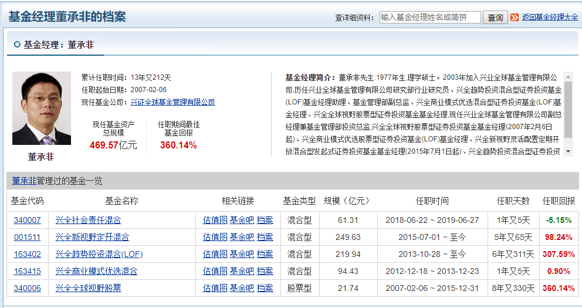

目前他运作的兴全趋势和兴全新视野定开基金，都是200亿的规模，但是新视野的业绩有点差，主要是因为，少赶上一波牛市，差距就差好多。

	

	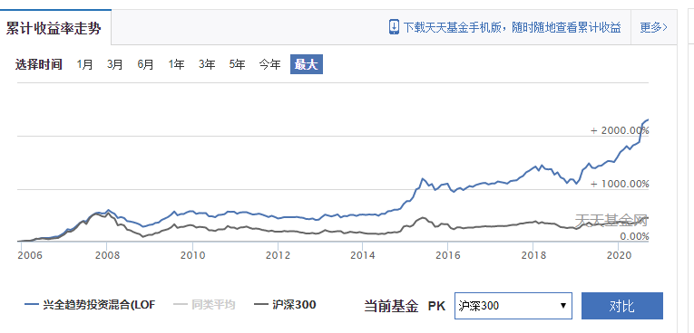

兴全趋势，最近3年对于指数的优势十分明显，而他的持仓基本也是以白马股为主，最近一个月比较抗跌，甚至已经悄无声息的开始创新高了。董承非的基金，基本都是进攻属性的，别人的基金靠防守拉开和指数的差距，而他的基金，在上升途中就能拉开差距，2015年，2017年和2019年非常明显。

这么大的规模，还能保持这种攻击力是十分不容易的。这种基金，最佳的策略就是长期拿着，最好在他跌下去，调整之后再买入，尽量不要在上升途中去追。

	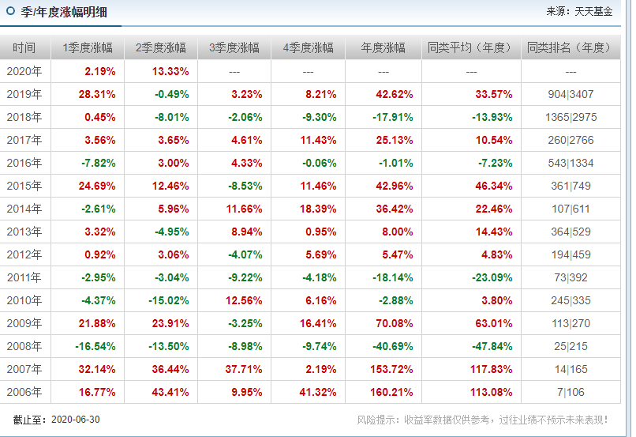

从过往业绩表现来看，有时候回撤幅度还是很大的，当他跑不赢同类的时候，其实才是买入的好时机。一般未来一两年，都会给你带来不少超额回报。而当他业绩特别好，远超同类的时候，就要小心一点，不是他过热了就是市场过热了。

## 毕天宇

富国基金，毕天宇手上三只基金，富国天博创新主题，富国高端制造，富国龙头优势，从业绩来看，肯定最为得意的是富国高端制造，这只基金近三年表现大幅超越市场。

	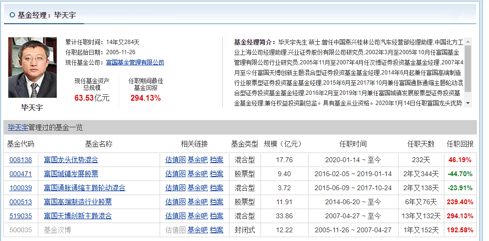

	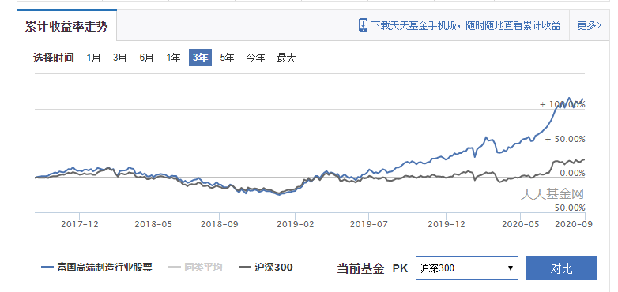

	

其实都是从2019年初开始的分化，主要也是因为，在2019年初之后，他开始转向了中小创。之前他有点名不副实，说是高端制造，但是却持有了茅台，平安，五粮液这样的公司，所以走势跟大盘十分接近，后来加大了国瓷材料这样公司的配置，而这只股票从3月到现在翻了一倍，也拉动了富国高端制造的业绩。

值得注意的是，他是股票型基金，仓位要求较高，所以会表现的比较激进。2018年他的回撤控制的不好，比指数跌的还要多。所以保守的投资者，慎选。今年业绩表现不错，远超同类和大盘，所以现在选择他，恐怕也并非一个好时机。他的重仓股上涨幅度都比较大了，未来小心回调的风险。

## 徐荔蓉

国海富兰克林基金，徐荔蓉最早是做债券的，然后又盯了几年指数，在申万菱信基金崭露头角，之后跳槽到了国海富兰克林基金，简称国富，跟上面的那个富国不是一家。

	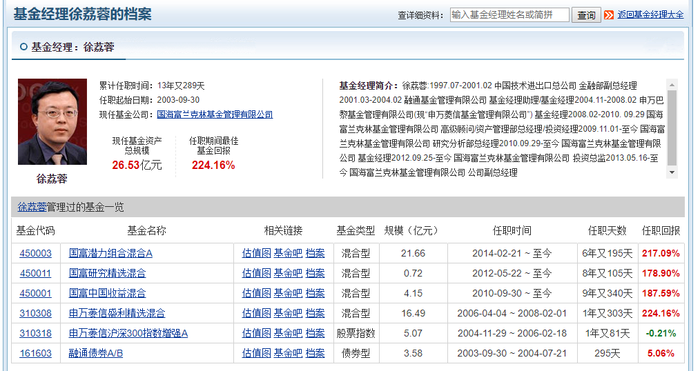

现在他的主力基金就是国富潜力组合，这个基金其实也是最近才表现特别好的，最近半年，大幅超越沪深300，但是如果跟创业板对比，你发现，今年以来也没啥优势，如果以三年期来看，他对创业板是有优势的，但有时主要展现在，2018年比较抗跌上，而一旦市场转暖，对创业板就没有优势了。

	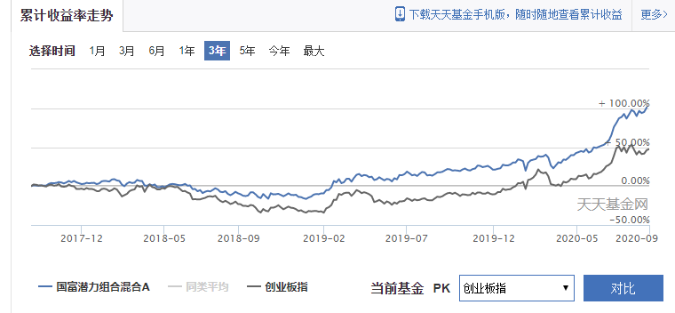

	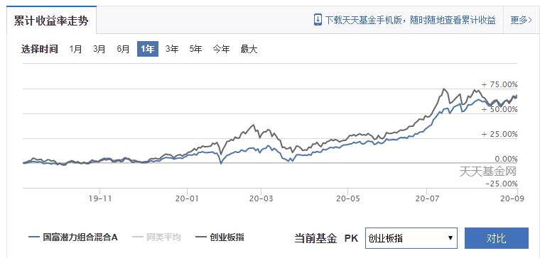

	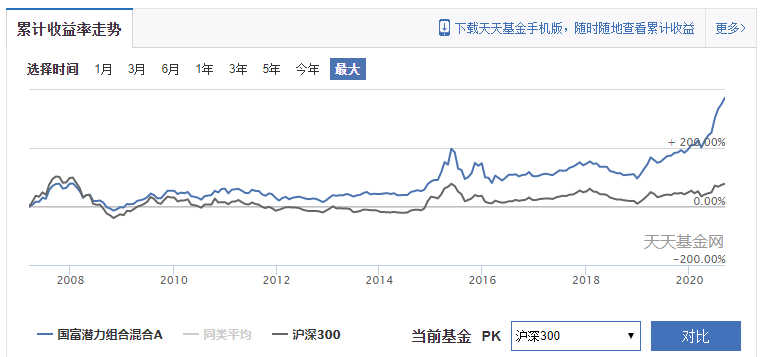

这个基金的投资逻辑，跟上面几个基金是不一样的，他的逻辑是自下而上，先选公司，然后再去看宏观，这样有个好处，那就是抗跌，我们看到国富潜力组合，它相对于沪深300产生的优势，几乎都来自于下跌，每次下跌，两条线中间的空隙就拉大一些。这种基金，一般比指数，先见底，所以投资他的最好时机，就是指数创新低，但他已经不再创新低的时候。比如2018年年底。一旦市场恢复，他必然是率先走出低迷，所以是一个很好的防守反击的利器。

	

反过来说，当指数涨的比他快了可能也就该面临调整了。调整完之后，买入这种基金，也是不错的选择。但关键是要长期持有，拥有耐心。

沪深300和创业板，这两种风格只要你能够跟对了，都不用控制回撤，也不用精选个股，你就已经是国内排名前十的基金经理水平了。而风格这东西，其实没那么复杂，3-3年半一个轮回，过去这10几年也就发生了2-3次转换，所以做人不能太贪，总想每年都翻倍，这个根本不现实。偶尔让你赶上一次，早晚也都会还回来。

## 王春

华安基金，主力基金是华安宏利混合，不过他是从汇添富基金跳槽过来的，在汇添富的时候，汇添富信息动态策略表现相当不错，也为他的个人履历，增加了不少收益。

	

这个华安宏利混合，表现也还说的过去，4年时间60%，收益也明显跑赢市场，而华安宏利是一只历史悠久的老基金，从2006年起经历了两次大牛市，最近才表现出足够多的优势。

	

	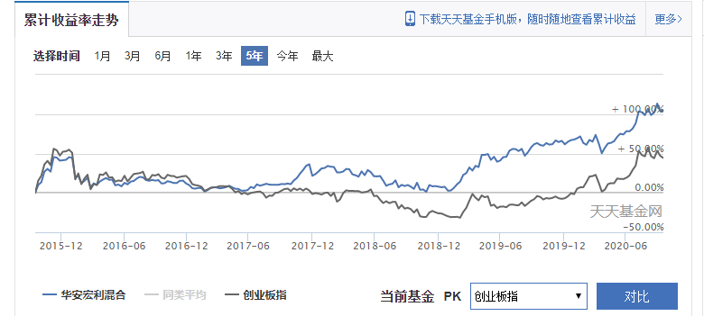

从王春到来之后的表现来看，2019年之前，该基金并没有跑赢指数，直到2019年中期之后才逐渐产生优势，但如果跟创业板比较，他跑的反而没有创业板快。这就说明，在2019年中期之后，华安宏利的风格，略微偏向了中小创。所以产生了一定的优势。从他的重仓股来看，其实仍然以银行地产白酒为主。

	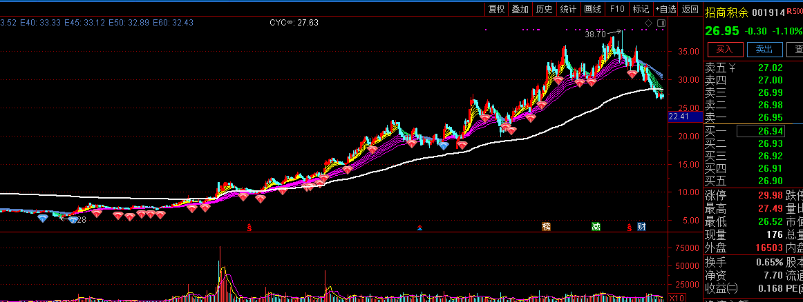

他重仓的招商积余，给2020年带来了不错的回报。不过他买的可能有点晚了，一季度才买，现在已经开始回撤了，这让他最近的业绩表现平平，最近半年没有跑赢指数。不过他现在手上白酒拿的有点多，这个基金还是要谨慎一点为好。

## 魏东

国联安基金，主力基金是国联安精选混合，他现在算是国联安基金的高管了，在国联安精选里面，也干了10年，业绩还是不错的，赚到了2.5倍。

	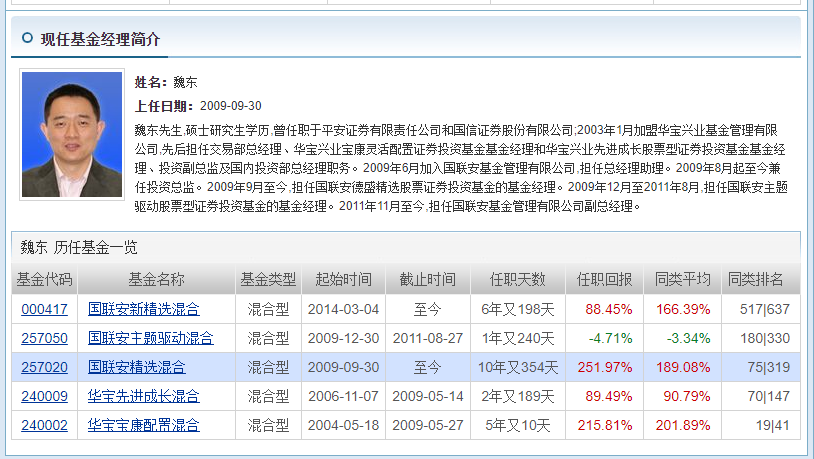

这只基金的业绩其实一直不温不火，2015年跑赢了指数，但是2018年回撤没控制好，回撤幅度比指数还要大，甚至比创业板跌的还多，主要是因为踩雷了康得新，足以见得，当时他的风格已经明显趋于中小创再加上踩雷，最终业绩很糟糕，但是这种风格明确的基金，跌的时候很快，涨起来同样很快。

	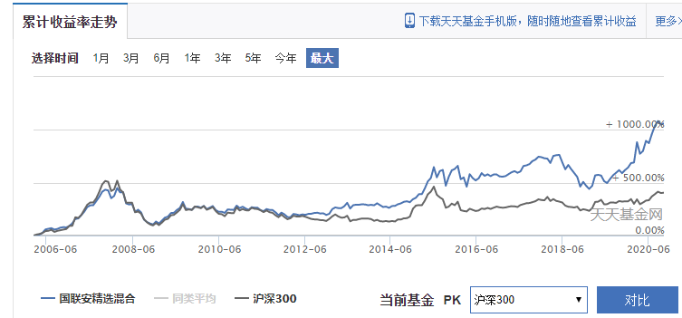

	

也正是因为这种，明确的跟踪中小创的风格，让他在2019年开始，走势几乎跟创业板重合。从现在的持仓来看，乐普医疗，中科创达，东山精密，兆易创新，这些都是前期市场的热门。2019年这波上涨，完全跟上了涨幅，但是最近也受到了创业板的调整影响。

这只基金属于是做风格的基金，就是盯住了风格，优选公司，跟上指数，2018年是个意外，主要被康得新给坑了。而康得新一直都是他的重仓股，这事也给我们提个醒，即便是基金，即便是高管，天天调研，你也无法识别财务造假。当一个人冒着犯法的风险坑你的时候，基本上防不胜防。

如果你把握不好市场风格，可以通过国联安精选去找方向。这种基金长期持有肯定没什么太大问题，但短期不确定。所以还是回撤比较大的时候，或者在熊市里面，去抓比较好。涨幅过大的时候，最好谨慎。

## 余广

景顺长城基金，主力基金是景顺长城精选蓝筹，但收益最高的是景顺长城核心竞争力。

	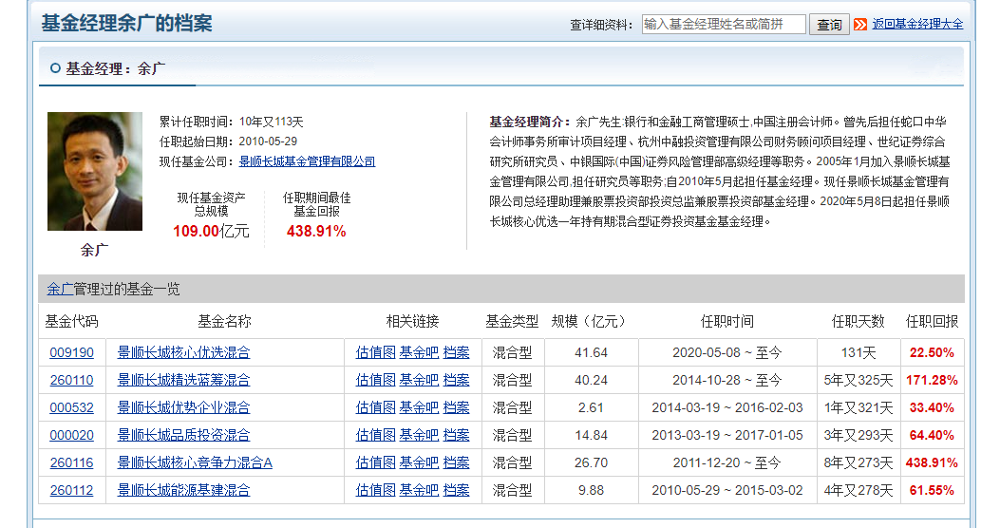

这只基金的重仓股，格力、茅台、顺丰、五粮液、立讯精密、药德康明，可以说基本都是大白马。

	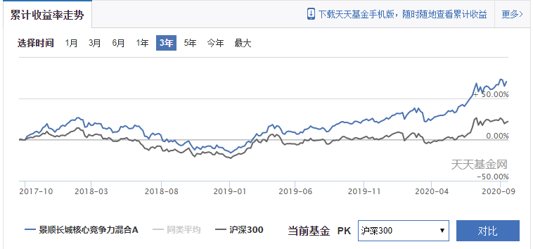

	

他的业绩也很稳定，最近三年缓慢超越大盘，最近一年的牛市，介乎于沪深300和创业板之间，不过他2018年的回撤，控制的也不好，比市场的平均跌幅还大，所以波动并不小，重仓股基本稳定，都是大白马，搭配一些中小板的明星公司，比如立讯精密，索菲亚，歌尔股份，海康威视，这种基金最好熊市买，他在选股上肯定有独到之处，但现在这些白马并不便宜，也已经都是明星，再出现起爆的可能性也不大，所以还是慎入。

## 郑煜

华夏基金，主力基金是华夏红利混合，她在这只基金里干了11年，业绩也不错将近3倍。

	

她的业绩优势，大部分都是2017年之前形成的，最近3年的业绩没有最近2年好，说明2018年回撤幅度也不小。

	

	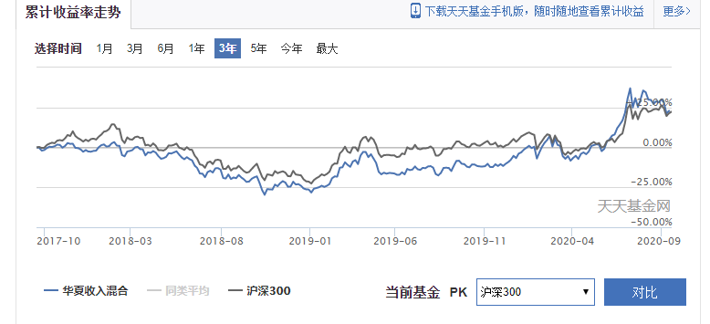

如果只算最近3年，华夏红利可谓表现糟糕，现在才跟指数差不多，今年之前，甚至都是落后指数的。之所以这么差，是因为跟魏东总一样，他也踩雷了，2018年踩雷康美药业，2018年3季度，康美还在他的重仓股里，而康美的暴跌发生在2018年10月，跌去了四分之三，估计华夏红利也损失惨重。

目前他的风格已经变小了，持股比较分散，10大重仓股，才占不到30%，这种持仓，通常都是基金经理心态的反应，他不想超越指数了，只想追踪指数。不求有功，但求无过，也许是最近几年业绩不佳和踩雷，所以压力较大，这种心态，是没有超额业绩可拿的。所以未来这只基金，最好的表现，估计也就是跟指数同步。不太可能有超越了。所以买这种基金，就不如直接买指数更划算，费率低，而且也不怕踩雷。

## 胡涛

嘉实基金胡涛，主力基金是嘉实优质企业和嘉实成长，嘉实优质企业时间比较长，6年2倍多的收益。

	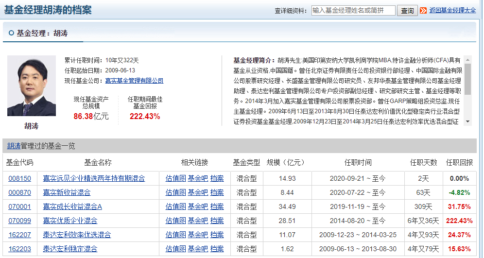

最近业绩极佳，主要是因为嘉实优质企业重仓股，除了医药就是科技，不过由于持股集中度比较低。最近回撤也还好，基本回撤控制在了10%。另外，他的持仓也并不固定，之前也投过很多的消费股和制造业的股票，所以他并不是用行业做投资的，应该属于是自下而上的思路，对自己的选股能力很有信心。

	

最近3个月，该基金表现不佳，没有跑赢大盘，主要是因为之前热门品种回撤导致，这样的基金其实符合买跌不买涨的理念，不过要提醒一点的是，他注重长期价值，所以不怎么主动控制回撤，比如2018年的时候，他的跌幅比指数还大。而且也经常很长一段时间跑不赢指数。所以投资这种基金，第一要慢，第二要有耐心。切忌一把梭，慢慢的买长期持有，总有他表现的机会。

	

防守不好的基金，一般进攻的时候都会比较犀利，所以2018年回撤较大之后，2019年这波上涨，他涨了一倍还多。如果你扛不住2018年的揍，就吃不到这块肥肉，所以如果要买这只基金，要有充分的心理准备。胡涛的投资方法，不一定马上见效，但是早晚会见效。

## 冯波

易方达基金冯波，主力基金是易方达行业领先，易方达中盘成长。

	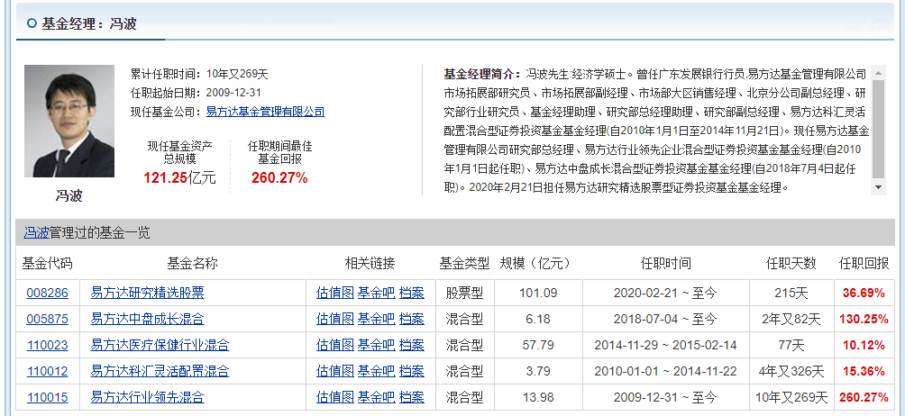

冯波的研究方向主要是喝酒吃药，他的易方达中盘成长，基本都是白酒医药股，偶尔有几个消费股，比如格力和伊利，他对医药行业是比较有研究的，曾经还在易方达医疗保健这个行业基金里干过一段。

	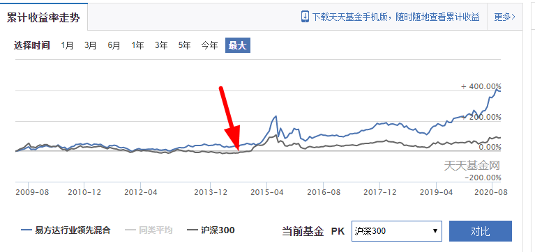

	

冯波上任后，易方达行业领先表现出色，这5年来，医药和消费其实并不同步，所以也对他的业绩有对冲，而最近这2年的行情，终于形成了合力，所以走势也明显好于大盘。也基本领先了创业板，如果从2019年初算，这只基金已经赚了120%，业绩相当出色了，但是也正是因为他有明显的白酒和医药属性，而这两个板块，现在又是明显高估的，所以我们不是特别看好他未来的表现。大家要小心点，小心他出现均值回归。

## 杨建华

长城基金杨建华，主力基金是长城品牌优选，还代管了两个指数，杨总技术出身，但是也喜欢喝酒吃药，现在持仓中白酒的比重极高，茅台、五粮液、泸州老窖、汾酒、古井贡、今世缘，外加一个青岛啤酒，除了白酒之外，之前还买过一些医药股，第三才是一些技术股，所以倾向性还是比较明显的。

	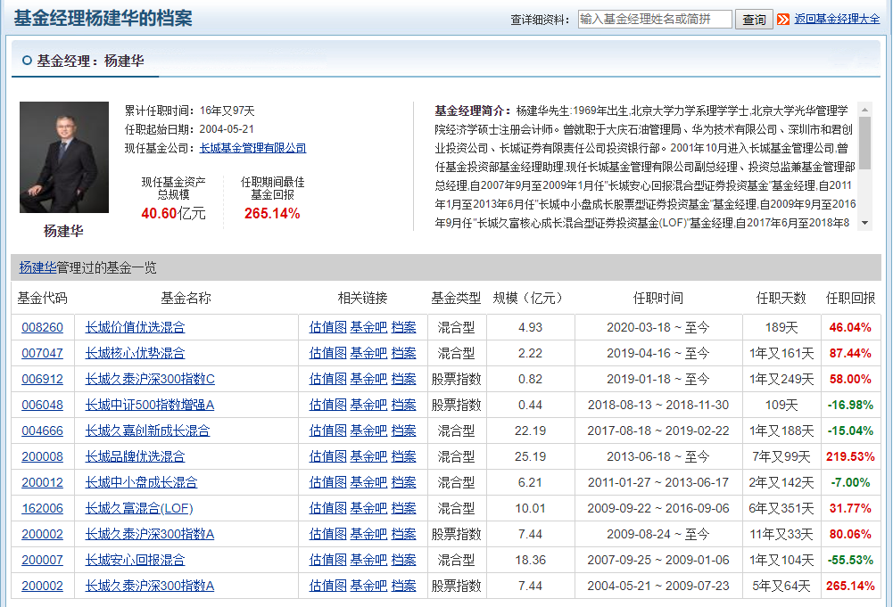

	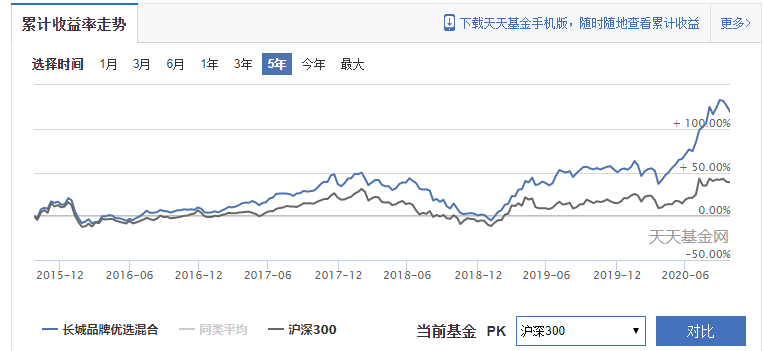

这只基金对于指数的长期优势，其实并不大，也都是最近这一波行情，才超越了指数，估计白酒股功不可没，所以这种有明显行业属性的主动基金，要先有所判别。不是他的基金表现多么出色，而是恰巧，他遇到了自己适应的风格，具有明显的随机性。这种基金，过往业绩越好，越不能投资，反而他过往业绩不好的时候，可以考虑。现在不建议碰这种基金。

## 杨谷

诺安基金杨谷，主力基金叫做诺安先锋，在这只基金里干了14年，业绩是6.5倍。

	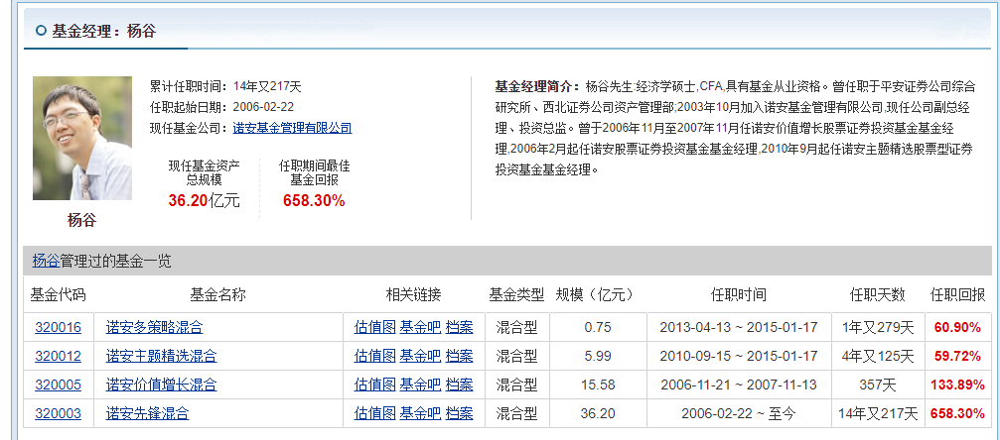

	

这十几年来，他其实业绩也一直不温不火，相对于指数创造优势，也是在最近这1年。

	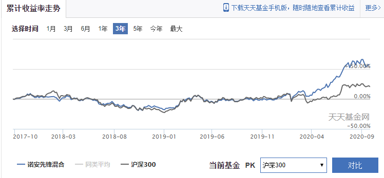

我们把指数放大，2019年，他都没有表现出任何优势，2020年3月才开始展现。主要原因，就是因为他拿了一手医药公司。同和药业，联化科技，山东赫达，苏博特，新和成，这都是他的重仓股，10大重仓股中，8家都是一水的医药制造和原料药企业。趁着今年的疫情，可算是上涨了一把。

	

这只基金的规模变动也比较大，2007年是炙手可热的明星，基金规模达到过400亿，之后市场转熊，他的规模也能维持在百亿左右，但是2013年以后，业绩比较差，所以2015年以后，规模就大幅缩水，如今规模只有30几亿。

所以这样的基金，他大体上可以等同于医药基金，肯定是不会建议在这个时候买医药的。虽然之前杨谷也投过一些其他的，比如保险，能源，制造业，但是都很难踩准节奏，只有这次医药，碰巧吃到肉了。所以你也很难说他到底是水平高呢还是运气好。

最后，多说一句，如何判断一只基金的好坏，你要看他过往的业绩表现，他在此之前，是否还抓住过其他机会，对于风格的把握是否准确，有没有自己固定的投资局限。这就好比我们看赛马是一个道理，你得先明白，到底是马快还是骑手快，这个问题要搞不清楚，那买基金也是会亏大钱的。

## 吕慧建

华泰柏瑞吕慧建，代表产品是华泰柏瑞行业领先，这只基金2009年到现在，一直是吕总在做经理，这个很难得，10几年取得2倍多的业绩，也算是还不错的成绩。

	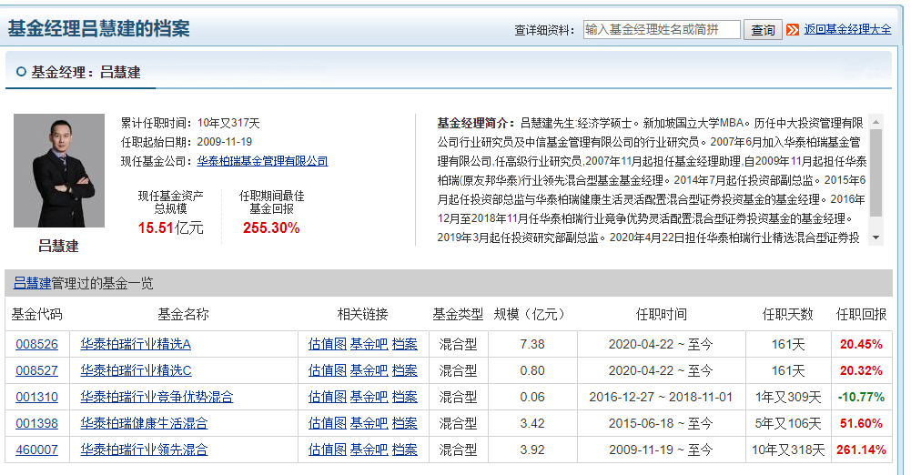

	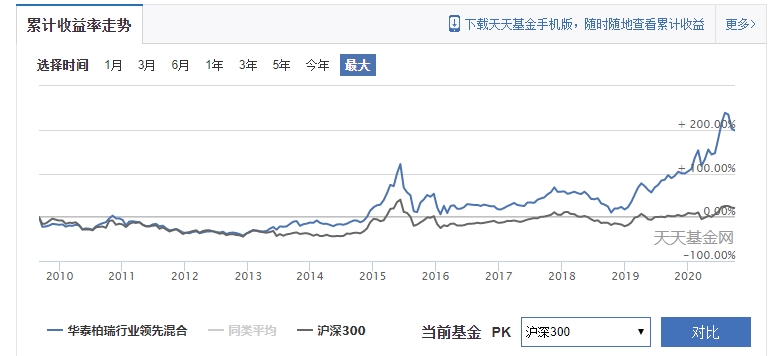

但是不得不说，这只基金，能够大幅超越市场，有一定的偶然性，他在2019年之前，都一直不温不火，这几年却突然猛涨。主要就是因为赶上了消费，医药和半导体三个行业同时爆发，这是他在过去一直重仓的行业，但是过往几年，这三个没发生过集体走强，所以他也没什么业绩表现。所以你可以把他当成这三个行业的综合基金去购买。他并不具备很好的择时能力。在绝大多数时刻，都是跑不赢指数的。

## 付浩

易方达付浩，他现在的代表基金就是易方达战略配售，这个基金的表现就很差了，2年才10%，不如买债券划算。他的主要业绩都是在基金科瑞的封闭基金时候产生的，之后弄的几个产品也都表现的很一般。

	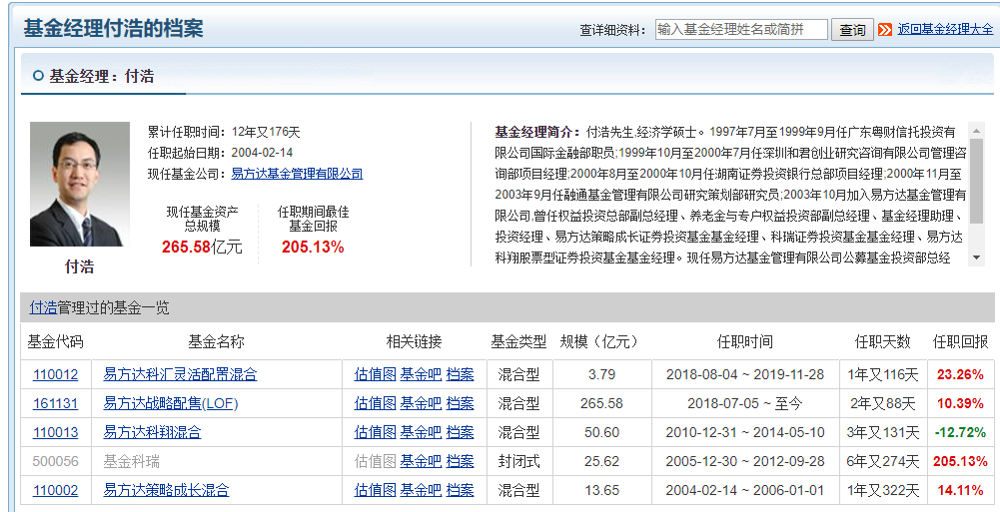

	

战略配售，不要买，这种小广告都发到自由市场的东西，必然是徒有其表，现在一看，股票配置比例还不到3成，债券也没加杠杆，所以股债收益都不佳，表现十分糟糕，白瞎了这两年的行情，几百亿的资金，根本就浪费了，完美错过了一个赚50%的机会，所以这种基金其实挺坑人的。他的目的根本就是为了那些大型的IPO保驾护航，根本就不是为了投资者赚钱，所以屁股歪了，结果也就不可能好。至于付浩，他现在是易方达基金公募投资部总经理，也就是说，他的心思完全在行政职务上，至于基金表现好不好，他自己估计也没上心，甚至是不是他在管，估计都不一定，就是挂个名号，跟管理层表个态，好像我们很重视而已。

## 邹唯

汇安基金邹唯，他是从嘉实基金跳到这个汇安基金的，目前汇安行业龙头还表现不错，但是规模太小，才1个亿，主要是因为这个汇安基金太小了，所以上不了规模。这个基金投资于半导体产业链，包括电池，芯片，互联网，集成电路，这些行业，运作时间也并不长。

	

	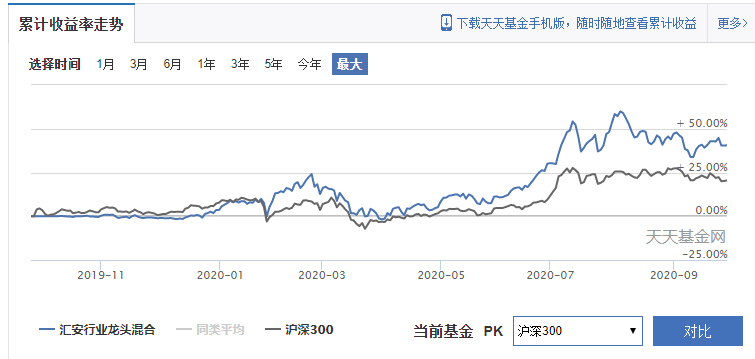

	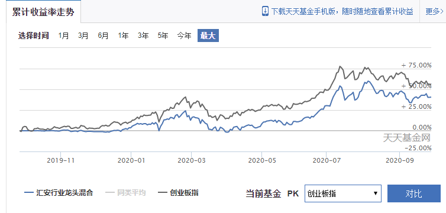

目前也看不太出来表现怎么样，基本都是股市涨他就跟着涨，股市跌就跟着跌，相对沪深300有点优势，但是跟创业板比就没有优势了，一直被创业板压着，所以这种基金还得再观察。

邹唯之所以入选明星经理，就是因为他在嘉实基金曾经表现出色，而且运气极佳，嘉实稳健从2006年接手，到2008年初卸任，这种超级大牛市，他一点没糟践，想不赚钱都难。但是自此之后，其实一直表现平平，所以他这个明星经理，其实名不副实。

## 姚锦

建信基金姚锦，她手上的主力基金是建信优选成长，8年近3倍的回报。现在从职务来说，也很高了，是建新基金权益投资部总经理。

	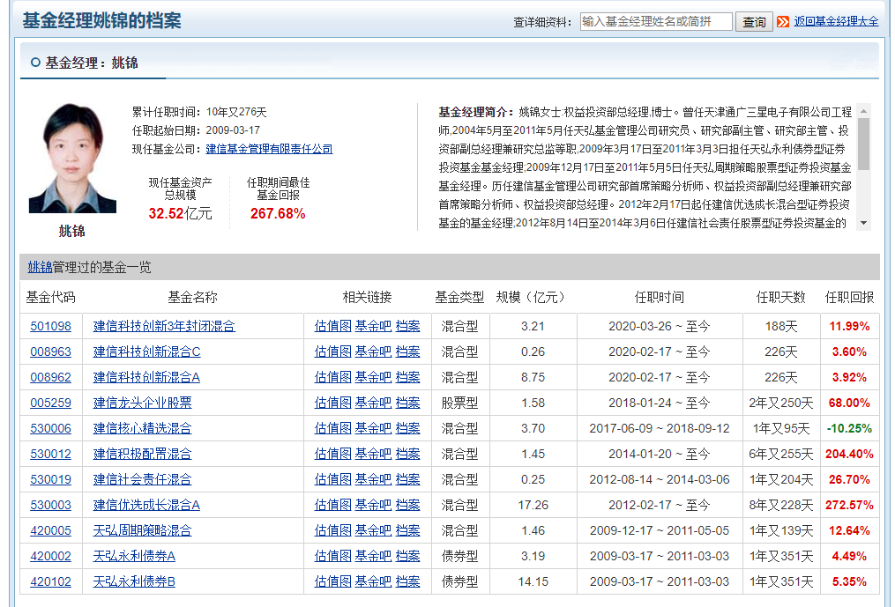

	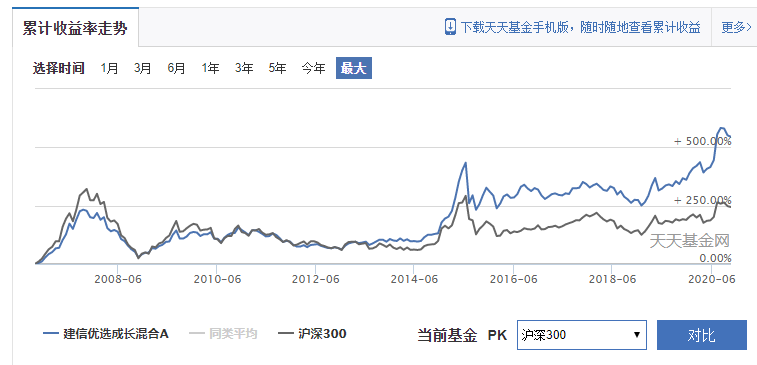

姚总2012年接手这只基金，然后2013年基金开始表现出足够的优势，在2015年超越市场不少。

	

2015年以后，其实表现也是比较一般，直到去年下半年，才又一次展现优势。他的持仓不怎么固定，而且变化还比较大，2016年一度重仓黄金煤炭，2019年又变成了重仓航空，国航，东航，南航，全都在重仓股序列，2017年-2019年最爱中国中免，而现在已经不在重仓股之中，所以我们看了半天也没发现什么思路，只能说明比较博爱，但是这种换仓，并没有带来结果上的优势。只有2016年稍微表现好了一点，但很快后面就又跌了回来，所以这种基金，可能也是属于大力出奇迹的。

当年产生了很好的回报，然后只要我们把时间一拉长，就业绩平庸了。所以这也给我们提个醒，你买基金的时候，也得去思考，看到底是能力强，还是运气好，又或者啥也不是，如果不能穿越周期的经理，也没有自己的投资思路，那么其实对于投资者来说，是一种巨大的伤害。