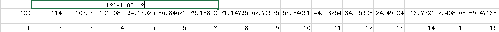
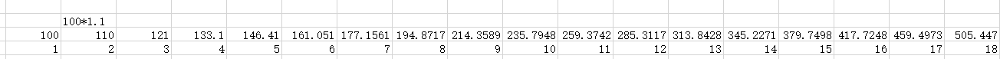

# 一套财务自由方案

做好自己该做的事情，不天天关注市场，有时间，多看书、多读报、多锻炼。

多少钱可以财务自由，其实这个没有绝对的标准，完全跟个人的消费能力有关，如果你想买私人飞机，那么20亿也未必自由，如果你只想过普通人的生活，其实用不了几百万就自由了，这套方案就跟把大象放进冰箱一样简单，只有三个步骤。

第一步，把你每月要花的钱，准备出12个月。放在账户1里面，这个账户只投资货币基金，哪个收益高就投哪个，货币基金绝对安全。假设你每月觉得1万块钱就够了，那你就准备12万。明年开始，每个月从这个账户里面领取，一个月1万元。

第二步，再准备一个账户2，从第二年开始，你的钱都要从这个账户里拿了，这个账户需要准备10年的月开销，还是假设你一个月1万开销，那么一年就是12万，10年就是120万，准备120万放在这个账户里，进行资产配置投资。按照保守的5%计算，每年也会有几万的回报，第一年取货币基金，第二年开始是120万X1.05=126万，被拿走12万，还有114万，第三年就是114万X1.05=119.7万，取走12万，还剩107.7万，以此类推到第16年的时候，这个账户就取干净了。

	

第三步，把剩余的钱，放到第3个账户里，这个账户以均衡资产为主。投资两个偏债基金，两个指数基金，一个股债均配的。如果以10年以上为周期，只要不看不动，这个组合应该可以获得10%以上的年化回报，而且会非常稳定。把剩下的钱全部投入到这个账户3里面就好，大概是16年翻4倍，而我们把之前两个账户花完的时候，应该就是第16年了，假设你还有100万资金，那么到时候这个账户里保守估计应该有400万资金，到时候你就把他取出来，按照上面的分配方法，再重新分配一遍就好。

	

另外，这个账户你要每年看一下，在年化10%以下的回报，你不用理他，而如果年化回报超过15%了，你就要止盈。然后等到他跌下来再买回去。举个例子，你买进去后可能5年不涨，这都不要理他。如果第6年开始暴涨，3年翻了4倍。总收益9年4倍，年化回报超过了16%，这时候你就需要出来休息一下。即便你出来等5年，没有收益，你的总回报都依旧超过10%。而这5年中，有很大可能会出现价值回归。

所以算一下，12万+120万+100万=232万，你只需要这么多钱，就可以实现一个月入万元的自由生活。当然你说我月入一万不够花，那么你月入2万，3万，5万都可以，方法是不变的。你要月开销达到5万，第一个账户就要存入60万，第二个账户要存入600万，第三个账户至少要有500万，也就说你有1160万，就可以实现一个月开销5万，年开销60万的自由生活了。这么算下来，你是不是发现，其实自由，不一定需要太多的金钱。

当然这里面我们打出了富裕，16年后，你的账户3里有4倍的资金，足够你再做一次资金分配，而且生活费支出可以提高50%，这个足以应对通胀的影响。但是如果你更小心谨慎，那么在账户2的时候就要考虑，每年都要比上一年多支出5%，用于应对通胀，那么账户2的消耗速度也就更快，那么此时你就得在账户2准备170万资金。公式是170万X1.05-12X1.05，把这个公式套入电子表格中就能算到16年后的结果。

	

也就是说，按照最保守的，考虑通胀的算法，月开销1万的生活，你只需要准备282万就足够了。月开销5万的生活，准备1410万。也并不是特别多。很多人唯一不踏实就是账户3，能否保持年化10%的增长，万一遇到极端，股市16年都没涨怎么办，这种情况，你每月该取多少钱，就继续取多少钱，从这个账户里往外拿。不用再分配。这里面够你再取上7-8年的，20年都没有一个大牛市的股市，历史上从没有发生过。这是一个极小极小的概率，而且即便真是这样，那么债券价格也早就涨上天了，第二个账户你都未必用的完。